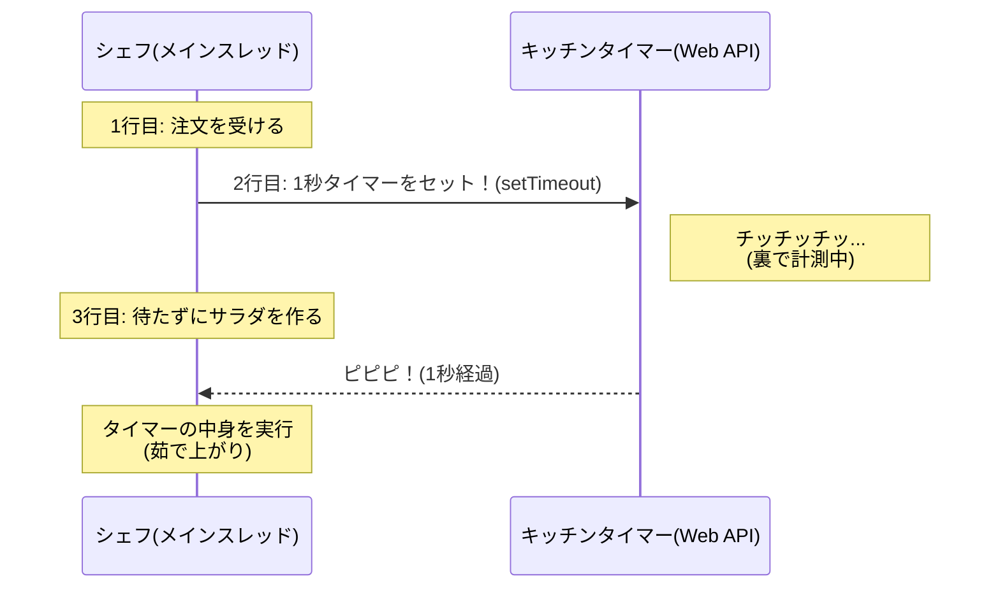

新シリーズ「JavaScriptの『時間』を操る！非同期処理・集中講座」の Day 1 です。
これまでのテイスト（キャラクター、心の旅、Mermaid図解）を完全に踏襲し、文系初学者のイチカどんでもスッと入れるように構成しました。

-----

# 🕰️ Day 1：JavaScriptは「ワンオペ」の達人

## 🏁 新しい冒険の始まり！

おかえりなさい！ 運動記録アプリの完成、本当におめでとうございます。
今日からは、プログラミングの世界で **「一番難しくて、でも一番面白い」** と言われる、 **「時間（非同期処理）」** という新しい魔法を学ぶ旅に出かけます。

「時間？ プログラムって一瞬で動くものじゃないの？」

そう思いますよね。でも、もしアプリが「通信中」にフリーズして動かなくなったら？ もし「3秒後にアラームを鳴らしたい」と思ったら？
そう、**「待つこと」をコントロールする技術**こそが、初心者と中級者を分ける大きな壁なんです。

これから13日間、焦らずゆっくり、この壁を乗り越えていきましょう！

-----

## 🍳 1.1 JavaScriptは「孤独なシェフ」である

まず最初に、JavaScriptという言語の「性格」を知っておく必要があります。
実はJavaScriptは、 **「一度に一つのことしかできない」** という、非常に不器用な性質を持っています。これを専門用語で **「シングルスレッド」** と言います。

イメージしてみてください。あなたのアプリは、 **「シェフが一人しかいない（ワンオペの）レストラン」** です。

  * **他の言語（JavaやC\#など）：**
      * 忙しくなったら、アルバイト（スレッド）を何人も雇って、「君は皿洗い」「君は注文取り」と、同時にいくつもの作業をこなせます（マルチスレッド）。
  * **JavaScript：**
      * **絶対に一人です。** どんなに忙しくても、シェフ一人でお店を回さないといけません。

### 🧠 初心者さんの、心の声

「えっ…それって、JavaScriptがショボいってこと？ 一人じゃすぐにお店が回らなくなっちゃうじゃん…」

そう思うかもしれません。でも、このシェフは **「段取りの天才」** なんです。
今日は、このシェフが「ダメな働き方」をした場合と、「天才的な働き方」をした場合の違いを体験してみましょう。

-----

## 🛑 1.2 実験！お店が止まる恐怖（ブロッキング）

まずは、シェフが「ダメな働き方」をしてしまった例を見てみます。
ブラウザのコンソールを開いて、以下のコードを実行してみてください。

```javascript
console.log('いらっしゃいませ！');
alert('ご注文をお伺いします！（OKを押すまで動きません）');
console.log('ありがとうございました！');
```

`alert()` というのは、ブラウザにメッセージを表示する命令です。
このコードを実行したとき、画面はどうなりましたか？

1.  「いらっしゃいませ！」が表示される。
2.  **画面にポップアップが出て、そこで全てが止まる。**
3.  「OK」ボタンを押すまで、「ありがとうございました！」は表示されないし、**画面の他のボタンを押すこともできない。**

### 🍳 シェフの行動

1.  お客さんが来た（ログ出力）。
2.  お客さんとお喋りを始めてしまい、**その話が終わるまで（OKを押すまで）、手元の作業を完全に止めてしまった。**

このように、一つの処理が終わるまで次の処理に進めず、全体の時間が止まってしまうことを **「ブロッキング（同期処理）」** と言います。
もしWebアプリで、データの読み込みに10秒かかるとき、画面が10秒間完全にフリーズしたら…ユーザーは「壊れてる！」と思って帰っちゃいますよね。

-----

## ⏱️ 1.3 解決策！キッチンタイマーを使おう（ノンブロッキング）

ワンオペのシェフが、お店を止めずに回すにはどうすればいいでしょう？
例えば、「パスタを茹でる（3分かかる）」という注文が入ったとき、鍋の前で3分間じーっとお湯を見つめていたら、その間レジも打てないし、他のお客さんの水も出せません。

そこで登場するのが、**「キッチンタイマー」** です！

JavaScriptの世界には、**`setTimeout`（セット・タイムアウト）** という便利なタイマーがあります。これを使うと、シェフの働き方はこう変わります。

### 🍳 タイマーを使った行動

1.  パスタを鍋に入れて、**タイマーを3分にセットする。**
2.  **タイマーが鳴るまでの間、すぐ次の仕事（レジ打ちやサラダ作り）に取り掛かる。**
3.  ピピピ！と鳴ったら、湯切りをする。

これなら、一人でもお店は止まりませんよね！ これを **「ノンブロッキング（非同期処理）」** と言います。

-----

## 🧪 1.4 実験！時間がずれる不思議

では、実際にタイマーを使ったコードを動かしてみましょう。
心の準備はいいですか？ 結果はあなたの直感と少し違うかもしれません。

```javascript
console.log('1. パスタを注文しました');

// キッチンタイマーをセット！ (1000ミリ秒 = 1秒後に実行)
setTimeout(() => {
    console.log('3. パスタが茹で上がりました！');
}, 1000);

console.log('2. サラダを作ります');
```

### 🧠 初心者さんの、心の旅

  * 「えっと、プログラムは上から順に動くんだよね？」
  * 「だから、『1. 注文』→ 1秒待って『3. 茹で上がり』→ 最後に『2. サラダ』…かな？」

**実行結果：**

```
1. パスタを注文しました
2. サラダを作ります
3. パスタが茹で上がりました！  <-- ※1秒後に遅れて表示される
```

「あれっ！？ 『2. サラダ』が先に出た！？」

### 解説：何が起きたの？

これこそが、ワンオペシェフの「段取り術」なんです。

1.  **注文:** 「パスタ注文」をログに出す。
2.  **タイマーセット:** `setTimeout` を見て、シェフは「よし、1秒後ね。**タイマーセットしたから、今は待たなくていいや！**」と判断して、**すぐに次の行へ進みます。**
3.  **次の仕事:** 待たずに「サラダ」をログに出します。
4.  **完了:** 1秒経ってタイマーが鳴ったので、手元の作業を中断して「茹で上がり」をログに出します。

### ⏳ 処理の流れ（シーケンス図）



-----

<br>
<br>
<br>

## ⏳ワン・オペラ⏳ オペラ座の怪人ならぬ「ワンオペ座の鉄人」


### 💬 「私の舞台（スレッド）に、役者は私一人だけ。<br>　 　 でも見ていて。タイマーという小道具一つで、<br>　 　 千の料理を踊らせてみせるわ⏳」

<br>
<br>
<br>

-----

## ✅ Day 1 のまとめ

今日は、コードをたくさん書くよりも、 **「JavaScriptの世界観」** を掴むことが大事な一日でした。

1.  **JavaScriptはワンオペ（シングルスレッド）** ：
      * 一度に一つのことしかできない。
2.  **待っちゃダメ（ブロッキング回避）** ：
      * `alert` のようにお客さんを待たせると、お店（ブラウザ）全体が止まってしまう。
3.  **タイマーを使おう（非同期処理）** ：
      * `setTimeout` を使うと、「予約」だけしてすぐに次の仕事に取り掛かれる。これならお店は止まらない！

「プログラムは上から下に、書いた順に動く」という今までの常識が、少しだけ崩れましたね。
でも、これができるようになると、通信待ちの間に「読み込み中くるくる」を表示したり、ユーザーを待たせない快適なアプリが作れるようになるんです。

明日は、この **「キッチンタイマー（setTimeout）」** をもっと使いこなして、アプリにデジタル時計を表示する実験をしてみましょう！

-----

<h1><a href="D02.md">Day2 へ</a></h1>


