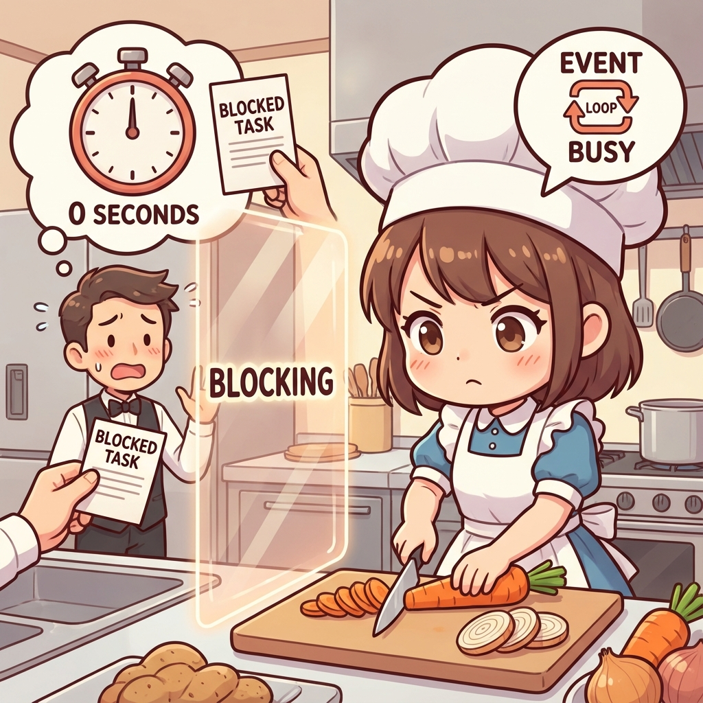
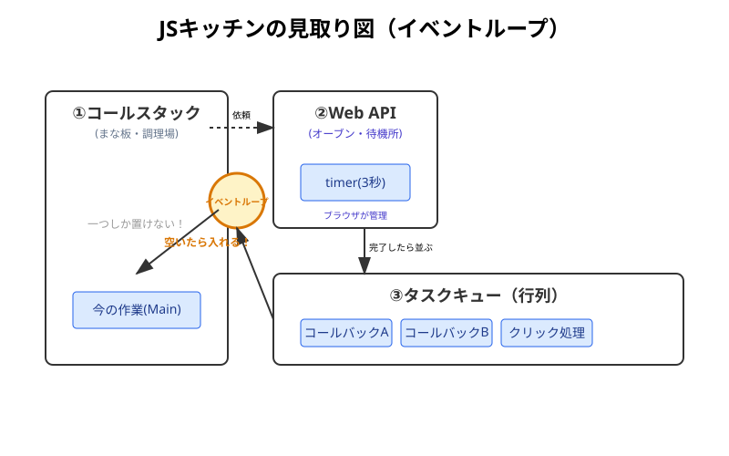
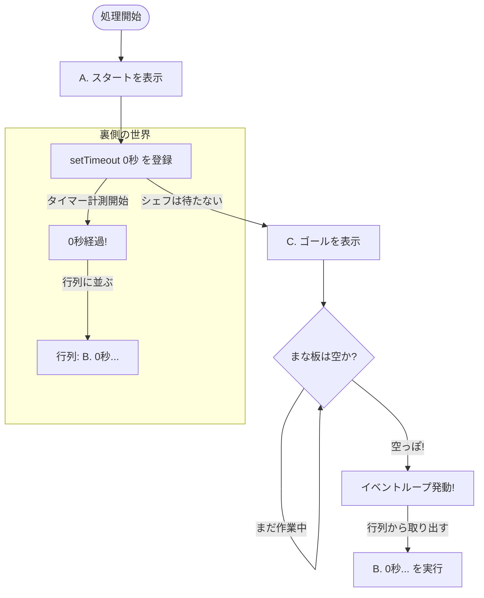
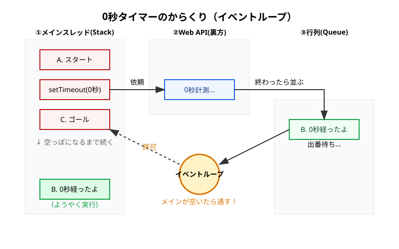

シリーズ第3回、**Day 3** のコンテンツです。
Day 1 の「ワンオペシェフ」、Day 2 の「キッチンタイマー」に続き、今日はシェフが止まらずに働き続けるための**「裏側のルール（イベントループ）」**を解き明かします。

直感に反する動きをする「0秒タイマー」のミステリーを通じて、非同期処理の核心に迫ります。

-----

# 🕰️ Day 3：イベントループという「魔法の整理術」

## ⏱️ 3.1 「0秒」なのに、すぐ実行されない！？

昨日は `setTimeout` で「3秒待つ」ことができました。
では、もし**「0秒待つ（＝待ち時間なし）」**と設定したら、どうなると思いますか？

「待ち時間がないんだから、すぐに実行されるはず！」




そう思いますよね。では、シェフ（JavaScript）の動きを実験してみましょう。
以下のコードをコンソールで実行してみてください。

```javascript
console.log('A. スタート！');

// 0秒後に実行してね！（つまり今すぐ！？）
setTimeout(() => {
    console.log('B. 0秒経ったよ！');
}, 0);

console.log('C. ゴール！');
```

### 🧠 初心者さんの、心の旅

  * 「えーっと、上から順番だから…」
  * 「『A. スタート』が出て…」
  * 「その次は『0秒』だから、すぐ『B. 0秒経ったよ』が出て…」
  * 「最後に『C. ゴール』かな？」

**実行結果：**

```
A. スタート！
C. ゴール！
B. 0秒経ったよ！  <-- ！？！？
```

「ええっ！？ なんで『C. ゴール』が先に出るの？ 0秒待機ってことは、一瞬でしょ？ なんで後回しにされたの？」


このミステリーを解く鍵こそが、ワンオペシェフが過労死せずに働き続けるための**「鉄の掟（イベントループ）」**なんです。

### 0秒タイマーと行列


「」

-----

## 🔪 3.2 シェフのキッチンの「3つのエリア」

この謎を解くために、シェフのキッチン（JavaScriptの裏側）を覗いてみましょう。
キッチンには、大きく分けて3つのエリアがあります。

1.  **まな板（コールスタック）：**
      * 今まさにシェフが作業している場所。
      * **ここには「一つ」しか置けません。**
2.  **オーブンやタイマー置き場（Web API）：**
      * 時間がかかる仕事（タイマー計測や通信）を放り込んでおく場所。
      * シェフの手を離れて、ブラウザが面倒を見てくれます。
3.  **伝票の行列（タスクキュー）：**
      * オーブンやタイマーが終わった仕事が、「次やってくださーい」と並ぶ場所。



-----

## 🔄 3.3 絶対ルール「手元が空くまで、次は呼ばない」

ここで一番大切なルールがあります。
それを管理しているのが、現場監督の **「イベントループ」** さんです。

> **👮 イベントループの鉄の掟**  
> **「まな板（コールスタック）の上で作業している間は、絶対に行列（タスクキュー）から新しい仕事を入れちゃダメ！」**

つまり、**「今やっている行のコード」が完全に終わるまでは、たとえ0秒で終わったタイマーがあっても、割り込み禁止**なんです。

### 🕵️ ミステリーの解説

さっきのコードで何が起きていたのか、スローモーションで見てみましょう。

1.  **`console.log('A. スタート')`**
      * まな板に乗る → 実行（表示） → まな板から消える。
2.  **`setTimeout(..., 0)`**
      * まな板に乗る → シェフ「あ、これはタイマーだね。Web APIさん、0秒よろしく！」と依頼 → まな板から消える（次の行へ！）。
3.  **Web API（裏側）**
      * 「0秒ですね、はい終わりました！」 → `console.log('B. ...')` を**行列（タスクキュー）の最後尾に並ばせる。**
4.  **`console.log('C. ゴール')`**
      * **ここが重要！** シェフはまだコードの続き（3行目）を処理中で、まな板は埋まっています。
      * だから、行列に並んでいる『B. ...』は、**まだ呼ばれません！**
      * まな板に乗る → 実行（表示） → まな板から消える。
5.  **イベントループ（現場監督）**
      * 「お、まな板が空っぽになったな？ コードも全部終わったな？」
      * 「よし、行列の先頭の人（『B. ...』）、入っていいよー！」
6.  **`console.log('B. 0秒経ったよ')`**
      * ようやくまな板に乗る → 実行（表示）。

### 🖼️ 0秒タイマーの動き（フローチャート）






-----

### 🧠 クイズ：どっちが先？

理解度チェックです！ 以下のコードを実行すると、「A」と「B」どちらが先に表示されるでしょうか？

```javascript
console.log('A. 受付開始');

setTimeout(() => {
    console.log('B. 呼び出し');
}, 0); // 0秒待ち

console.log('C. 受付終了');
```

<details>
<summary>答えを見る（クリック）</summary>

**正解は...**

1.  **A. 受付開始**
2.  **C. 受付終了**
3.  **B. 呼び出し**

**解説：**
「0秒待ち」でも、`setTimeout` を使った時点で、その処理は**一度行列（タスクキュー）の最後尾に並ばされます。**
その間に、シェフ（JavaScript）は手元の仕事（AとCの表示）を全部終わらせてしまいます。
手元が空っぽになって初めて、行列の先頭にある「B」が呼ばれるのです。

これが分かれば、イベントループは免許皆伝です！
</details>

<br>
<br>
<br>

## 💂‍♀️マダム・キュー💂‍♀️行列をさばく鬼の整理係


### 💬 「割り込み？ お断りよ！<br>　 　 たとえ0秒で終わろうが、社長の命令だろうが、<br>　 　 『最後尾』に並んで待ちなさい。<br>　 　 今の作業が終わるまで、私はゲートを開けないわよ💂‍♀️」


<br>
<br>
<br>

-----

## 🧠 3.4 なぜこんなルールがあるの？

「0秒なら、ちょっとくらい割り込ませてくれても良くない？」

もし割り込みOKだったら、どうなるでしょう？
例えば、「計算をして、結果を表示する」という作業の途中に、突然「クリックされた！」とか「通信が終わった！」という別の仕事が割り込んでくると、計算中の数字がおかしくなったり、画面がカクカクしたりしてしまいます。

JavaScriptは、**「今やっていること（同期処理）」を最優先で終わらせる**ことで、プログラムの整合性を守っているんです。

  * **同期処理（A, C）：** 王様。最優先。
  * **非同期処理（B）：** 家来。王様の仕事が全部終わるまで、行列で待機。

この優先順位があるから、JavaScriptはワンオペでもパニックにならずに動けるんですね。

-----


ようするに「
・２つのJavaScriptの関数は絶対同時には実行されない
・関数実行の予約がされたら、JavaScriptが「何も実行してない時だけ」予約からとりにいくってことね


---

## ✅ Day 3 のまとめ

今日は、JavaScriptの裏側で動いている「イベントループ」という仕組みを覗き見しました。

1.  **3つのエリア** ：「まな板（スタック）」「タイマー置き場（Web API）」「行列（キュー）」がある。
2.  **鉄の掟** ：「まな板が空っぽになるまで、行列の仕事は入れない」。
3.  **0秒の正体** ：「0秒後に実行」ではなく、**「0秒後に『行列に並ぶ』」**という意味だった！

だから、`setTimeout` を使うときは、**「指定した時間に必ず実行されるわけじゃなくて、最低でもその時間は待つ（そして今の作業が終わるのを待つ）」**という感覚を持つのが正解です。

-----

さて、これで「タイマー」を使った実験は終わりです。
明日は、このタイマーをたくさん使って、**「昔のプログラマーがいかに苦労していたか」**を体験します。

「Aが終わったらB、Bが終わったらC…」
これをタイマーで書こうとすると、コードの形がとんでもないことになります。通称**「波動拳」**と呼ばれるそのコードとは…！？

明日は地獄の入り口へご案内します。お楽しみに！

-----

<h1><a href="D04.md">Day4 へ</a></h1>
