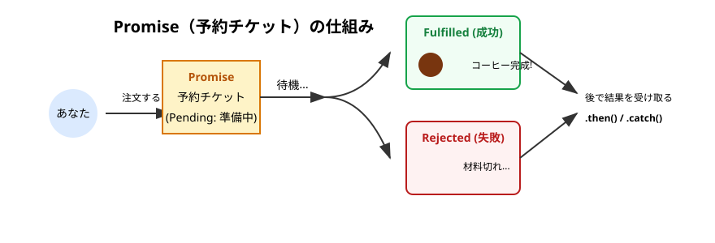
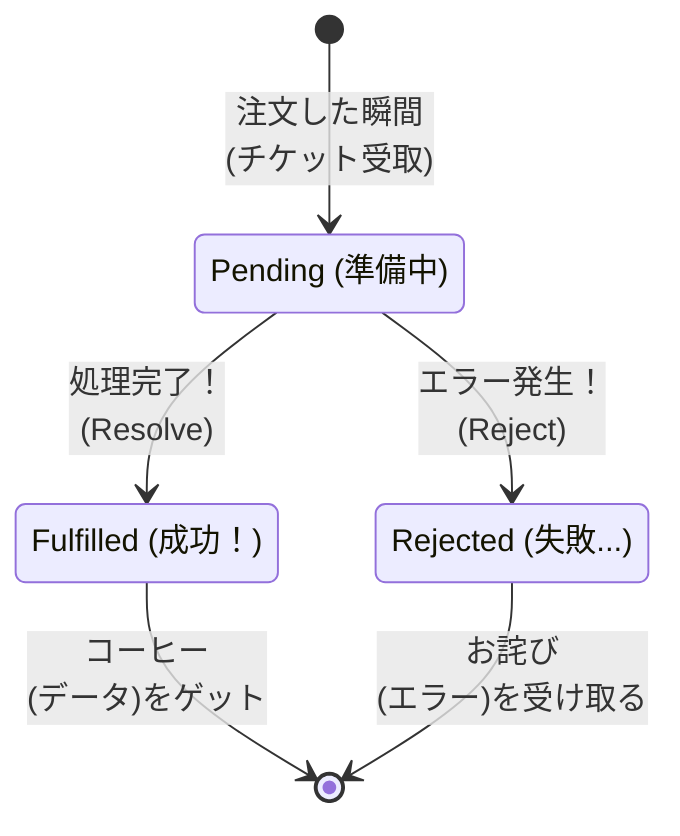
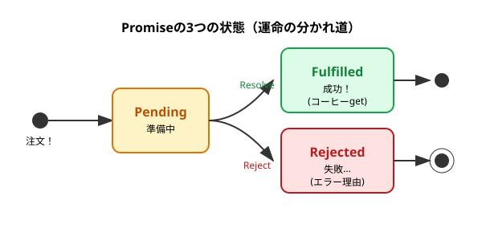

シリーズ第5回、**Day 5** のコンテンツです。
昨日の「コールバック地獄（波動拳）」で、私たちは深く傷つきました。
今日は、その地獄から私たちを救い出してくれる **「Promise（プロミス）」** という概念について学びます。

ただし！ **今日はコードを書きません。**
いきなり難しい書き方を覚える前に、まずは「Promiseって要するに何？」というイメージを、 **「予約チケット」** のメタファーを使って完全に腹落ちさせましょう。

-----

# 🕰️ Day 5：フクロウ伯爵の「予約チケット（Promise）」

## 🦉 5.1 コーヒーは「今」渡せない

昨日の「コールバック地獄」、大変でしたよね。
「終わったらこれやって、その次あれやって…」とお願いばかりしていると、コードがどんどん複雑になってしまいます。

そこで、JavaScriptの世界に新しいキャラクターが登場しました。
**「未来のことは約束（Promise）しよう」** が口癖の、 **プロミス伯爵**（フクロウ）です。

彼のカフェでの注文方法は、今までの「ワンオペシェフ」とは少し違います。

### ☕ 今までの注文（コールバック）

1.  あなた「コーヒーください」
2.  シェフ「あいよ！ 淹れるから、**できるまでレジの前で待ってて！**（出来上がったら渡すから！）」
3.  あなた「（じーっ…待つ）」
4.  シェフ「はいどうぞ！」

### 🦉 プロミス伯爵の注文（Promise）

1.  あなた「コーヒーください」
2.  伯爵「かしこまりました。淹れるのに時間がかかりますので、**この『予約チケット』をお持ちください**」
3.  あなた「（チケットを受け取って、席でスマホを見たりして待つ）」
4.  伯爵「チケット番号の方、出来ましたよ」
5.  あなた「チケットと交換でコーヒーをもらう」

この **「予約チケット」** こそが、`Promise`（プロミス）の正体なんです！

-----

-----

 
 
 

## コーヒー

### 💬 「」

 
 
 

-----

## 🎫 5.2 チケットの「3つの状態」

プロミス伯爵から渡された「予約チケット（Promiseオブジェクト）」は、時間とともに **3つの状態** に変化します。
この3つの言葉は、これから毎日使うので覚えてあげてください。

### 1\. `Pending`（ペンディング）：準備中

  * **意味：** まだコーヒーが出来ていない状態。
  * **状況：** あなたはチケットを握りしめて待っています。
  * **イメージ：** 「調理中…」

### 2\. `Fulfilled`（フルフィルド）：成功！

  * **意味：** 無事にコーヒーが出来上がった状態！
  * **状況：** チケットが **「コーヒー（成功データ）」** に変わります。
  * **イメージ：** 「お待たせしました！（データ到着）」
  * ※専門用語で「解決（Resolve）」とも言います。

### 3\. `Rejected`（リジェクテッド）：失敗…

  * **意味：** 何らかのトラブルで、コーヒーが作れなかった状態。
  * **状況：** チケットが **「お詫びの手紙（エラー理由）」** に変わります。
  * **イメージ：** 「申し訳ありません、豆が切れました…（エラー発生）」

-----

## 🖼️ 図解：チケットの運命

チケット（Promise）は、必ず「成功」か「失敗」のどちらかに変化します。
一度変化したら、もう元には戻りません（コーヒーを受け取った後に、豆切れにはなりませんよね）。

### 🧠 初心者さんの、心の旅

  * 「なるほど！ 今までは『データそのもの』が来るのを待ってたけど、Promiseは『とりあえずチケット』を先にくれるんだ。」
  * 「`const coffee = orderCoffee();` って書いたとき、変数 `coffee` に入ってるのは、飲み物じゃなくて **『チケット（Promise）』** なんだね！」
  * 「だから、すぐに飲もうとすると『紙（チケット）なんて飲めないよ！』ってエラーになるのか…納得！」

-----

## 📜 5.3 なぜ「地獄」が消えるの？

「チケット制になっただけで、何が嬉しいの？」

いい質問です。チケット制の最大のメリットは、**「次に何をするか」を、チケットを受け取った「後」で決められる**ことです。

### 昔（コールバック）

注文するときに、全ての指示をしないといけません。
「コーヒーください。**できたらミルクを入れて、そのあと砂糖を入れて、そのあと席に運んで…**」
（これが、あの「波動拳コード」の原因でした）

### 今（Promise）

とりあえずチケットだけもらって、席につきます。
「コーヒーください。（チケット受け取り）」
席についてから、ゆっくり考えます。
**「よし、このチケット（Promise）が『成功（Fulfilled）』に変わったら、そのときミルクを入れよう」**

このように、**「注文」と「その後の処理」を切り離せる**おかげで、コードがスッキリ整理できるようになったんです！

-----

 
 
 

## 🦉プロミス伯爵🦉 未来を司る紳士

### 💬 「ホーウ、焦りは禁物ですよ。 　 　 私が渡したのは『データ』ではありません。 　 　 『未来への約束（Promise）』なのです。 　 　 約束が果たされるその時まで……優雅にお待ちを🦉」

 
 
 

-----

## ✅ Day 5 のまとめ

今日はコードを書かずに、概念だけをしっかりインストールしました。

1.  **Promiseは「予約チケット」** ：
      * データそのものではなく、「未来に結果を渡す」という約束のオブジェクト。
2.  **3つの状態** ：
      * `Pending`（準備中）
      * `Fulfilled`（成功！）
      * `Rejected`（失敗…）
3.  **嬉しいポイント** ：
      * とりあえずチケットだけもらえるから、**「結果が出たあとのこと」を後から書ける**（これがコールバック地獄を解消する鍵！）。

「じゃあ、そのチケットをどうやってコーヒー（データ）と交換するの？」

気になりますよね。
明日は、いよいよこのチケットを使って、**「チケットが成功に変わったら、これをやって！」** というコード（`.then()`）を書いてみます。

地獄のコードが、魔法のように一本の線に変わる瞬間をお見せしますよ！

-----

<h1><a href="D06.md">Day6 へ</a></h1>

