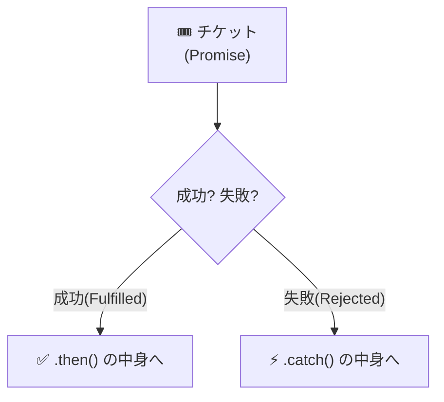
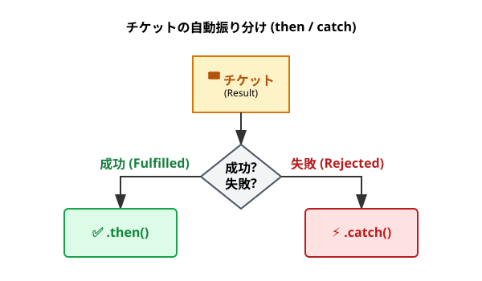
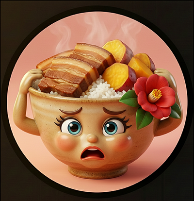
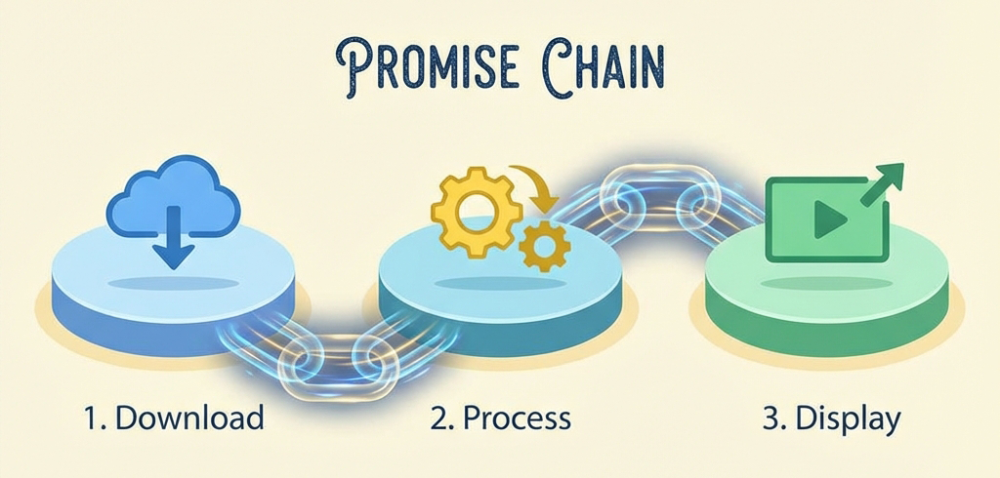
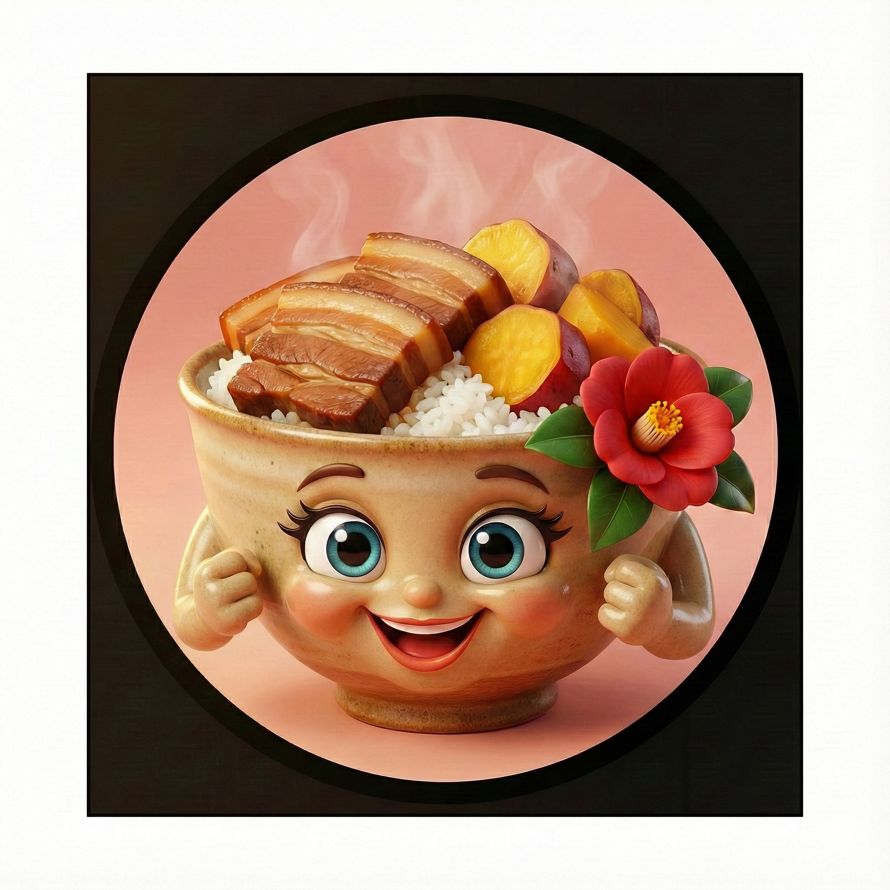
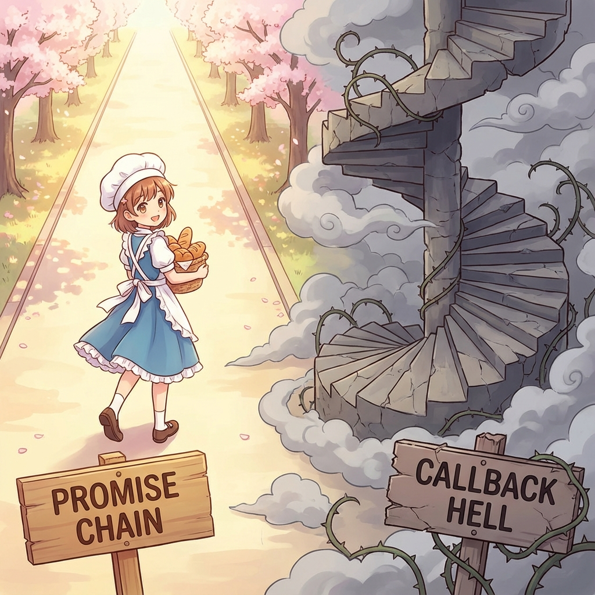
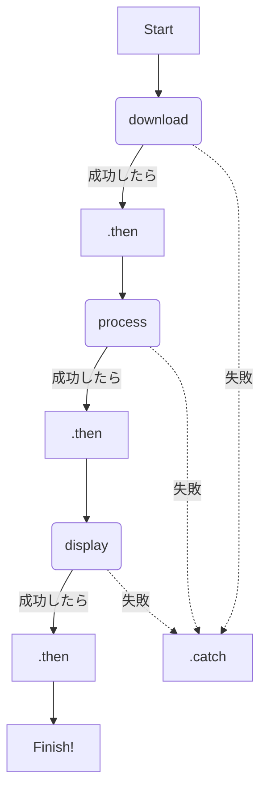
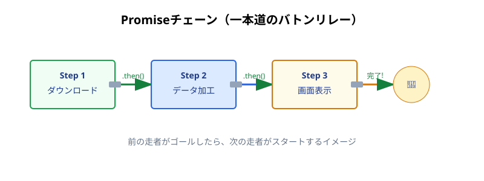

シリーズ第6回、**Day 6** のコンテンツです。
昨日はフクロウ伯爵から「予約チケット（Promise）」をもらいました。
でも、チケットを握りしめているだけではコーヒーは飲めませんよね。

今日は、このチケットを使って実際に **「処理をつなげる（チェーンする）」** 書き方を学びます。
Day 4で見たあの恐ろしい「波動拳コード」が、魔法のように一本の線に変わる瞬間を目撃してください！

-----

# 🕰️ Day 6：チケットの交換 ～.then()チェーン～

## 🎫 6.1 チケットを「窓口」に出そう

昨日は概念だけでしたが、今日はいよいよコードを書きます。
プロミス伯爵から受け取った「予約チケット（Promiseオブジェクト）」には、ある **特別な窓口（メソッド）** がついています。

それが、**`.then()`（ドット・ゼン）** です。

日本語に訳すと **「～そしてその後（then）」** という意味ですね。
使い方はとってもシンプルです。

```javascript
// 1. 注文して、チケット(Promise)をもらう
const ticket = orderCoffee(); 

// 2. チケットに「窓口」をつける
ticket.then((coffee) => {
    // 3. 成功(Fulfilled)したら、ここが実行される！
    console.log('☕ 受け取りました:', coffee);
    drink(coffee);
});
```

### 🧠 初心者さんの、心の旅

  * 「なるほど！ `ticket.then(...)` っていうのは、 **『チケットが成功に変わったら、このカッコの中の関数を実行してね』** っていう予約なんだ。」
  * 「これなら、コーヒーができる前に飲もうとしてエラーになることもないね！」

-----

## 💥 6.2 失敗した時の窓口 ～.catch()～

でも、もしコーヒー豆が切れて作れなかったら？
チケットは「失敗（Rejected）」に変わります。
その時に備えて、 **「トラブル相談窓口」** も用意しておきましょう。

それが、**`.catch()`（ドット・キャッチ）** です。

```javascript
ticket
    .then((coffee) => {
        console.log('☕ 成功！:', coffee);
    })
    .catch((error) => {
        // 失敗(Rejected)したら、ここが実行される！
        console.log('😢 失敗...:', error);
    });
```

### 🖼️ チケットの分岐（フローチャート）






成功なら `.then()` へ、失敗なら `.catch()` へ。
まるで線路のポイント切り替えみたいに、自動的にルートを選んでくれるんです。便利ですよね！

-----

## ⛓️ 6.3 必殺！ Promiseチェーン

さて、ここからが今日の本番です。
Day 4の「コールバック地獄」を覚えていますか？
「ダウンロード → 加工 → 表示」を順番にやろうとして、コードが `}}}}` だらけになったアレです。

Promiseを使うと、この地獄を **「チェーン（鎖）」** のように真っ直ぐつなぐことができます。
これを **「Promiseチェーン」** と呼びます。

### 👿 昔の書き方（コールバック地獄）

```javascript
download((data) => {
    process(data, (processed) => {
        display(processed, () => {
            console.log('完了！');
        });
    });
});
```

（うっ…頭が痛くなりそう…）  




### ✨ 今の書き方（Promiseチェーン）

```javascript
download()
    .then((data) => {
        console.log('1. ダウンロード完了！');
        // 次の処理（加工）を返す
        return process(data); 
    })
    .then((processed) => {
        console.log('2. 加工完了！');
        // 次の処理（表示）を返す
        return display(processed);
    })
    .then(() => {
        console.log('3. 表示完了！');
        console.log('🎉 すべて完了！');
    })
    .catch((error) => {
        console.log('⚠️ どこかでエラーが起きました:', error);
    });
```

### 🧠 初心者さんの、心の旅

  * 「うわぁっ！ 三角形が消えた！」
  * 「上から下に、 **『.then（そして）』→『.then（そして）』→『.then（そして）』** って読んでいける！」
  * 「しかも、`.catch` は最後に一個書くだけで、途中のどこで失敗しても拾ってくれるの？ すごすぎる！」



そうなんです。Promiseチェーンは、 **「前の作業が終わったら、その結果を持って次の作業へ」** というバトンリレーを、ネスト（入れ子）せずに書ける画期的な発明なんです。

### ⛓️ チェーンの仕組み（イメージ図）








-----

<br>
<br>
<br>

## 🧴プロミス伯爵🧴淑女のたしなみ


### 💬 「いかがです？ 美しいでしょう。<br>　 　 鎖（チェーン）のように処理をつなげれば、<br>　 　 どんなに長い工程も、一本の物語になるのです。<br>　 　 エラー処理もスマートに。これが紳士のコードですよ🦉」

<br>
<br>
<br>

-----

## 🧪 6.4 【発展】 チケットの発行所（裏側）

「チケットを使う方法は分かったけど、そもそもプロミス伯爵はどうやってチケットを作ってるの？」

気になりますよね。
実は、裏側では **`new Promise`** という魔法を使って、手作業でチケットを発行しているのです。

### 🏭 チケット製造のコード

```javascript
// 伯爵の仕事場（関数の中身）
function orderCoffee() {
    // 1. 「新しいチケット(Promise)」を作る
    // 引数には、成功(resolve)と失敗(reject)のスイッチが渡される
    return new Promise((resolve, reject) => {

        console.log('伯爵「今からコーヒーを淹れますよ...」');

        // 2. 何か時間がかかる処理（ここでは3秒待つ）
        setTimeout(() => {
            
            const isSuccess = true; // 今回は成功したとする！

            if (isSuccess) {
                // 3. 成功したら resolve(成功データ) を呼ぶ！
                // → これが、使っている人の「.then()」に飛んでいく
                resolve('☕ ホットコーヒー'); 

            } else {
                // 4. 失敗したら reject(エラー理由) を呼ぶ！
                // → これが、使っている人の「.catch()」に飛んでいく
                reject('💥 豆がない！');
            }

        }, 3000);
    });
}
```

### 🔑 2つのスイッチ

*   **`resolve(データ)`** （リゾルブ）：
    *   意味：「解決！」。チケットを「成功（Fulfilled）」に変えるスイッチ。
    *   効果：これを呼ぶと、待っていた人の **`.then()`** が動き出す。
*   **`reject(エラー)`** （リジェクト）：
    *   意味：「拒否！」。チケットを「失敗（Rejected）」に変えるスイッチ。
    *   効果：これを呼ぶと、待っていた人の **`.catch()`** が動き出す。

こうやって、伯爵が裏で `resolve` を押してくれたからこそ、私たちの元にコーヒーが届いていたんですね。
今は「使う側」だけで大丈夫ですが、レベルアップして「ライブラリを作る側」になったら、このコードを書くことになりますよ！


-----

<br>
<br>
<br>

## 🔮 待てをかける時間魔女ジュノ


### 💬 「約束のバトン回しは上手になった？ 次は時間を止める呪文よ。<br>　 　 明日は『await！』と唱えるだけで、世界が静止するから覚悟しなさい🪄」

<br>
<br>
<br>

-----

## ✅ Day 6 のまとめ

今日は、チケット（Promise）の使い方と、必殺技「Promiseチェーン」を学びました。

1.  **`.then()`** ： 成功した時の処理を書く場所。「チケットを商品と交換！」
2.  **`.catch()`** ： 失敗した時の処理を書く場所。「トラブル対応！」
3.  **Promiseチェーン** ： `.then()` をつなげて書くことで、**コールバック地獄（波動拳）をまっすぐな一本道にする魔法**。

「すごい！ これでもう完璧だね！」

…と思いますよね？
でも、実は人間の欲望にはキリがありません。
プログラマーたちは、このチェーンを見てこう思ってしまったのです。

**「`.then` とかカッコ `() => {}` を書くのすら、面倒くさくない？」**
**「もっとこう…普通の日本語みたいに書きたいんだけど…」**

明日は、そんなワガママを叶えるために生まれた、 **現代JavaScript最強の魔法「async/await」** が登場します。
今日のコードが、さらに劇的に、信じられないほど短くなりますよ！

-----

<h1><a href="D07.md">Day7 へ</a></h1>


