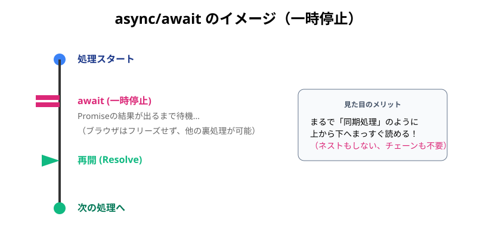

シリーズ第7回、**Day 7** のコンテンツです。  
昨日の「Promiseチェーン」で、コードは一本道になり、かなり読みやすくなりました。  
でも、人間とは欲深い生き物です。「`.then()` とかカッコ `() => {}` を書くのすら面倒くさい！」「もっと普通の日本語みたいに書きたい！」と思ってしまったのです。

今日は、その願いを叶える現代JavaScriptの最強魔法、**`async`（エイシンク）** と **`await`（アウェイト）** を伝授します。  
これを知ってしまうと、もう元の書き方には戻れないかもしれません…！

-----

# 🕰️ Day 7：魔法の「一時停止」ボタン ～async/await～

## 🪄 7.1 「待て」と言えば、時は止まる

Day 6のコードを見てみましょう。  
チェーンのおかげで綺麗にはなりましたが、まだ少し「プログラミングっぽい記号」が多いですよね。

```javascript
// 昨日のコード（Promiseチェーン）
download()
    .then((data) => {
        return process(data);
    })
    .then((processed) => {
        return display(processed);
    });
```

「もし、この `.then` とか `return` を全部消して、こんなふうに書けたら最高だと思いませんか？」

```javascript
// 理想の書き方（直感）
const data = download();      // ダウンロードして...
const processed = process(data); // 加工して...
display(processed);           // 表示する！
```

「でも、これじゃ『待ち時間』がないから、エラーになっちゃうんでしょ？」

そう、Day 1で学んだ通り、JavaScriptは「止まらない」から、ダウンロードが終わる前に次に行っちゃうんでしたね。  
でも…もし、 **「ここぞという時だけ、シェフ（JavaScript）を一時停止させる魔法」** があったら？

それが、**`await`（待て！）** です。

-----

## 🎩 7.2 魔法の言葉「async」と「await」

この魔法を使うには、2つのキーワードを覚えるだけでOKです。  


### 1\. `async`（エイシンク）

  * **意味：** 「この関数の中では、時間の魔法を使いますよ」という宣言。
  * **使い方：** 関数の前に書く。
  * **例：** `async function startWork() { ... }`
  * **アシンクの呼称** 「アシンク・アウェイト」の方が、対象的で日本人には言いやすいので、そのように呼称する人も多いです。

### 2\. `await`（アウェイト）

  * **意味：** 「待て！ チケット（Promise）が商品に変わるまで、ここで一時停止せよ！」
  * **使い方：** Promise（時間がかかる処理）の前に書く。
  * **例：** `const coffee = await orderCoffee();`

この2つを使うと、さっきの「理想のコード」が、本当に動くようになるんです！



### 👮‍♂️ 守るべき2つの「鉄の掟」

この魔法、強力すぎて制限があります。絶対に破ってはいけません。

1.  **`await` は `async function` の中でしか使えない！**
    *   普通の関数の中で `await` と叫んでも、「は？ 何それ？」とエラーになります。
    *   必ず、その関数に `async` マークがついているか確認してください。

2.  **`async function` は必ず「Promise」を返す！**
    *   `async function main() { return 100; }` と書いても、戻ってくるのは `100` ではなく **`Promise<100>`（100が入った箱）** です。
    *   だから、`main()` を呼び出す側も、中身を取り出すために `.then` や `await` が必要になることがあります。

この2つさえ守れば、あなたは時間の支配者です！

### 💀 見落としがちな第3の掟
さらにもう一つ、絶対に忘れてはいけないルールがあります。

3.  **呼び出し元放置の罠（Unhandled Rejection）**
    *   `async function` はPromiseを返すと説明しましたね。もしその関数の中でエラーが起きたら、そのPromiseは「失敗（Rejected）」状態になります。
    *   これを `await` も `.catch()` もせずに放置すると、**「エラーが起きたのに誰も気づかない（無視される）」** という恐ろしい状態になります。
    *   特に **「ボタンを押した時のイベントハンドラ」** などでやりがちです。

```javascript
// × 危険な書き方
button.addEventListener('click', async () => {
    await dangerousWork(); // ここでエラーが出たら...？
    // 誰もcatchしていないので、エラーは闇に葬られる（またはアプリがクラッシュする）！
});

// ○ 安全な書き方
button.addEventListener('click', () => {
    // ちゃんとcatchで受け止める
    main().catch(e => console.error(e));
});
```
「やりっぱなしはダメ、ゼッタイ」。  
Promiseを返されたら、必ず責任を持って最後まで見届ける（awaitするかcatchする）のが大人のマナーです。

-----

-----

-----

<br>  
<br>  
<br>

## 🧙‍♀️タイム・ウィッチ🧙‍♀️ 時を止める魔女


### 💬 「『待て（await）』。<br>　 　 私がそう唱えれば、結果が出るまで時は止まる。<br>　 　 難しい鎖（チェーン）なんて捨てなさい。<br>　 　 あなたはただ、書きたいことを順に書けばいいのよ🧙‍♀️」

<br>  
<br>  
<br>

-----

## ✨ 7.3 劇的ビフォーアフター

では、Day 4の「コールバック地獄」、Day 6の「Promiseチェーン」、そして今日の「async/await」を見比べてみましょう。

### 👿 ビフォー（Day 4：コールバック地獄）

```javascript
download((data) => {
    process(data, (processed) => {
        display(processed, () => {
            console.log('完了！');
        });
    });
});
```

### 🔗 プログレス（Day 6：Promiseチェーン）

```javascript
download()
    .then((data) => process(data))
    .then((processed) => display(processed))
    .then(() => console.log('完了！'));
```

### ✨ アフター（Day 7：async/await）


```javascript
// 魔法を使うための関数を定義
async function main() {
    console.log('🚀 スタート！');

    // awaitをつけるだけで、完了するまでここでピタッと止まってくれる！
    const data = await download(); 
    console.log('1. ダウンロード完了！');

    const processed = await process(data);
    console.log('2. 加工完了！');

    await display(processed);
    console.log('3. 表示完了！');
    
    console.log('🎉 すべて完了！');
}

// 実行！
main();
```

### 🧠 初心者さんの、心の旅

  * 「えっ…？ これ、本当に動くの？」
  * 「`.then` も `callback` もないよ？ 普通に上から下に書いてるだけに見えるけど…。」
  * 「`await download()` って書くと、ダウンロードが終わるまで、次の行に行かずに待っててくれるんだ。まるでDay 1の `alert` みたいに止まってくれる。でもブラウザはフリーズしないの？ すごい魔法だ！」

 

そうなんです！ `await` は、**「見た目は同期処理（上から下）、中身は非同期処理（ちゃんと待つ）」** という、夢のような書き方なんです。

この記述方法は「C#言語」から発足され、  
非常に優れた記法であるため、他の言語へと続々と広がってきています。

### 🎓 コラム：なぜフリーズしないの？

「`await` で止まるなら、Day 1 の `alert` みたいに画面が固まらないの？」

いい質問です！ 実は `await` で止まっている間、シェフ（JavaScript）は **「ただボケーっとしている」わけではありません。**  
裏側では、Day 3 で学んだ **「イベントループ」** が働いています。

1.  `await` にぶつかると、シェフは「あ、これ待ち時間だね」と判断して、**その関数の実行を中断**します。
2.  そして、**「他の仕事（ボタンクリックや画面描画）」に戻るのです！**
3.  Promise（チケット）の結果が出たら、また戻ってきて続きを始めます。

だから、「コードは止まっている（待っている）ように見えるのに、画面はサクサク動く」という魔法が実現できるんですね。

-----

-----

## 🛡️ 7.4 エラーはどうやって捕まえるの？

Promiseチェーンのときは `.catch()` を使いました。  
`async/await` のときは、Day 13（運動アプリ）でチラッと出てきた **`try...catch`** 構文を使います。

「やってみて（try）、ダメだったら捕まえる（catch）」という、直感的な書き方です。

```javascript
async function main() {
    try {
        // ここに「成功するはず」の処理を全部書く
        const data = await download();
        const processed = await process(data);
        await display(processed);
        console.log('🎉 大成功！');

    } catch (error) {
        // 途中で誰かが「失敗（Reject）」したら、すぐにここにワープしてくる！
        console.log('😢 エラーが発生しました:', error);
        
    } finally {
        // 成功しても失敗しても、最後に必ず実行される
        console.log('👋 お疲れ様でした（後片付け）');
    }
}
```

### 🧠 初心者さんの、心の旅

  * 「`.catch()` メソッドをつなげるんじゃなくて、コード全体を `try` ブロックで囲むんだね。」
  * 「ダウンロードで失敗しても、加工で失敗しても、全部 `catch` ブロックに飛んでくるから、エラー処理が一箇所で済む！ これなら私にも書けそう！」

-----


<br>  
<br>  
<br>

## 🛡️ 失敗上等のシールド騎士


### 💬 「時間を止められても、矢は飛んでくる。<br>　 　 明日は try-catch で盾を構えるぞ。エラー？ まとめて受けて立つさ🛡️🔥」

<br>  
<br>  
<br>

-----

## ✅ Day 7 のまとめ

今日は、非同期処理の学習における**最大の到達点**にたどり着きました。

1.  **`async`** ： 関数に「時間の魔法を使うよ」と宣言する。
2.  **`await`** ： Promiseの結果が出るまで、処理を一時停止する（そして結果を取り出す）。
3.  **普通のコードみたい** ： コールバックやチェーンを使わず、上から下に書けるので、圧倒的に読みやすい！
4.  **`try...catch`** ： エラー処理は、普通のJavaScriptの構文がそのまま使える。

「難しいことは、全部魔法（構文）がやってくれる」  
これが現代のJavaScriptです。

ここまでの7日間で、  
「ワンオペの弱点」を知り、  
「タイマー」で時間を操り、  
「地獄」を味わい、  
「チケット」をもらい、  
ついに **「魔法（async/await）」** を手に入れました。

これで、あなたの手元には最強の武器があります。  
次はいよいよ、Part 3。この魔法を使って、 **「自分のPCの外側（インターネット）」** へ冒険に出かけましょう。

「天気予報が見たい」「犬の画像が見たい」  
そんな願いを叶えるための扉 **`fetch()`** が、あなたを待っています！

-----

<h1><a href="D08.md">Day8 へ</a></h1>


