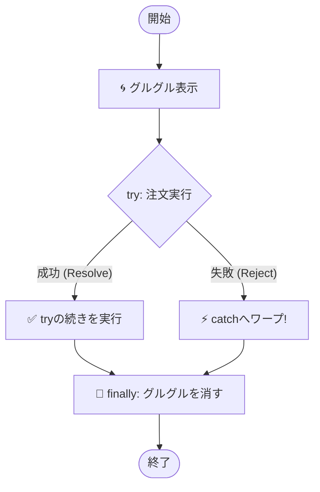

シリーズ第8回、**Day 8** のコンテンツです。
昨日の「async/await」で、非同期処理をスラスラ書けるようになりました。
でも、もし「通信中にWi-Fiが切れたら」？ 「サーバーがダウンしていたら」？

今日は、そんな\*\*「もしものトラブル」**が起きても、アプリをクラッシュさせずに優しく守るための**「保険（エラーハンドリング）」\*\*について学びます。

-----

# 🕰️ Day 8：失敗した時の「保険」 ～try...catch 再訪～

## ⛈️ 8.1 魔法にも「失敗」はある

Day 7で覚えた魔法 `await`。
「待て！」と言えば、チケット（Promise）が商品（データ）に変わるまで待ってくれましたね。

でも、Day 5でフクロウ伯爵が言っていたことを思い出してください。
チケットは、成功（Fulfilled）するとは限りません。
\*\*失敗（Rejected）\*\*することもあるんでしたよね？

  * **成功：** コーヒーを受け取る ☕
  * **失敗：** 「豆が切れました…」というお詫びの手紙を受け取る ✉️

もし、`await` している最中に「失敗」が起きたら、どうなるでしょう？

```javascript
async function main() {
    // もしここでエラー（失敗）が起きたら…？
    const coffee = await orderCoffee();
    
    // ここから下の行は実行されず、画面が真っ赤（エラー）になって止まります！
    console.log('いただきまーす！'); 
}
```

**ブッブー！🚨**
何の対策もしていないと、アプリはそこで\*\*クラッシュ（強制終了）\*\*してしまいます。
お店でお客さんに「豆がない！」と叫んで、そのまま店長が逃亡するようなものです。最悪ですよね。

-----

## 🛡️ 8.2 転ばぬ先の杖 `try...catch`

そこで登場するのが、以前（Day 13）少しだけ触れた **`try...catch`（トライ・キャッチ）** 構文です。
これを使うと、\*\*「失敗した時専用のルート」\*\*を作ることができます。

### 構文のイメージ

  * **`try` { ... }** ： 「とりあえず、やってみる場所」。成功する前提のコードを書く。
  * **`catch` (error) { ... }** ： 「失敗した時に逃げ込む場所」。エラー対応を書く。

これを `async/await` と組み合わせると、最強の防御壁になります！

```javascript
async function main() {
    try {
        // -----------------------
        // 🟢 成功ルート（try）
        // -----------------------
        console.log('🙏 注文してみます...');
        const coffee = await orderCoffee();
        
        // 成功しないと、この行には来ない！
        console.log('☕ コーヒーゲット！:', coffee);
        
    } catch (error) {
        // -----------------------
        // 🔴 失敗ルート（catch）
        // -----------------------
        // orderCoffeeが「失敗（Reject）」したら、
        // すぐにここにワープしてきます！
        console.log('😢 トラブル発生！ 店員さんの言い訳:', error);
        alert('申し訳ありません、ただいまコーヒーが出せません。');
    }
}
```

### 🧠 初心者さんの、心の旅

  * 「なるほど！ `try` のブロックは『結界』みたいなものかな？」
  * 「この中でエラーが起きても、アプリ全体がクラッシュするんじゃなくて、`catch` の部屋に移動するだけなんだ。」
  * 「これなら、店長が逃亡せずに『ごめんなさい』って言えるね！」

-----

## 🧹 8.3 最後に必ずお掃除 ～finally～

実は、もう一つ便利なブロックがあります。
それが **`finally`（ファイナリー）** です。

  * **成功しても、失敗しても、最後に絶対やってほしいこと**

これを書く場所です。
例えば、Webアプリでよく見る\*\*「読み込み中…（グルグル）」\*\*の表示。
成功しても失敗しても、処理が終わったら「グルグル」は消さないといけませんよね？

```javascript
async function main() {
    // 1. グルグルを表示する
    showLoadingSpinner();

    try {
        const data = await downloadData();
        showData(data); // 成功！

    } catch (e) {
        showError(e);   // 失敗！

    } finally {
        // 3. 成功でも失敗でも、最後にグルグルを消す！
        // これを書かないと、エラーの時にグルグルが回りっぱなしになっちゃう！
        hideLoadingSpinner();
    }
}
```

### 🖼️ 処理の流れ（フローチャート）



-----

## 🧪 8.4 実験！運命の50%

では、ランダムで成功したり失敗したりする「気まぐれなカフェ」を作って、`try...catch` の動きを確認してみましょう。
以下のコードをコンソールで実行してみてください。

```javascript
// 気まぐれな注文関数（半分失敗する）
function luckyOrder() {
    return new Promise((resolve, reject) => {
        // 0.5秒待ってから...
        setTimeout(() => {
            const isLucky = Math.random() > 0.5; // 50%の確率
            if (isLucky) {
                resolve('✨ 最高級マンデリン'); // 成功！
            } else {
                reject('💥 カップを割ってしまいました...'); // 失敗！
            }
        }, 500);
    });
}

// 注文を実行する関数
async function order() {
    console.log('📢 注文します！');
    
    try {
        const coffee = await luckyOrder();
        // 成功したらここが動く
        console.log('😊 やったー！ 届いたのは:', coffee);
        
    } catch (error) {
        // 失敗したらここが動く
        console.log('😭 残念...', error);
        
    } finally {
        // どっちでも動く
        console.log('🔚 お店を出ます（処理終了）');
    }
}

// 何回か実行してみよう！
order();
```

何度か実行すると、「😊 やったー！」の日と、「😭 残念...」の日があるはずです。
でも、**どちらの場合も必ず「🔚 お店を出ます」が表示される**こと（アプリが止まっていないこと）を確認してください。

これが「堅牢（けんろう）なコード」への第一歩です！

-----

<br>
<br>
<br>

## 🛡️シールド・ガードナー🛡️ 鉄壁の守護者

\

### 💬 「エラーは敵ではない。予期せぬ来客だ。<br>　 　 玄関（try）を開けておけ。<br>　 　 私（catch）が丁重にお帰り願うから。<br>　 　 おっと、帰り際のお土産（finally）も忘れずにな🛡️」

<br>
<br>
<br>

-----

## ✅ Day 8 のまとめ

今日は、非同期処理につきものの「エラー」と仲良くする方法を学びました。

1.  **`try { ... }`** ：
      * `await` を含む、エラーが起きるかもしれない処理をこの中に書く。
2.  **`catch (e) { ... }`** ：
      * Promiseが「失敗（Reject）」した時だけ実行される場所。
      * ここで `alert` を出したり、リカバリーしたりする。
3.  **`finally { ... }`** ：
      * 成功失敗に関わらず、最後に必ず実行される場所。
      * 「読み込み中」を消す処理などはここに書くのが鉄則。

これで、あなたの書く非同期処理は、**成功したらデータを使い、失敗しても優しくメッセージを出す**ことができるようになりました。もう「画面が真っ白」になる恐怖とはサヨナラです！

さて、ここまでは「一つの処理」を待つ方法でした。
でも、「コーヒー」と「トースト」と「サラダ」を頼んだ時、一つずつ順番に待っていたら日が暮れちゃいますよね？

明日は、複数の注文を\*\*「同時に」**さばくテクニック、**`Promise.all`\*\* について学びます。
シェフの分身の術…！？ お楽しみに！

-----

\<h1\>\<a href="D09.md"\>Day9 へ\</a\>\</h1\>
