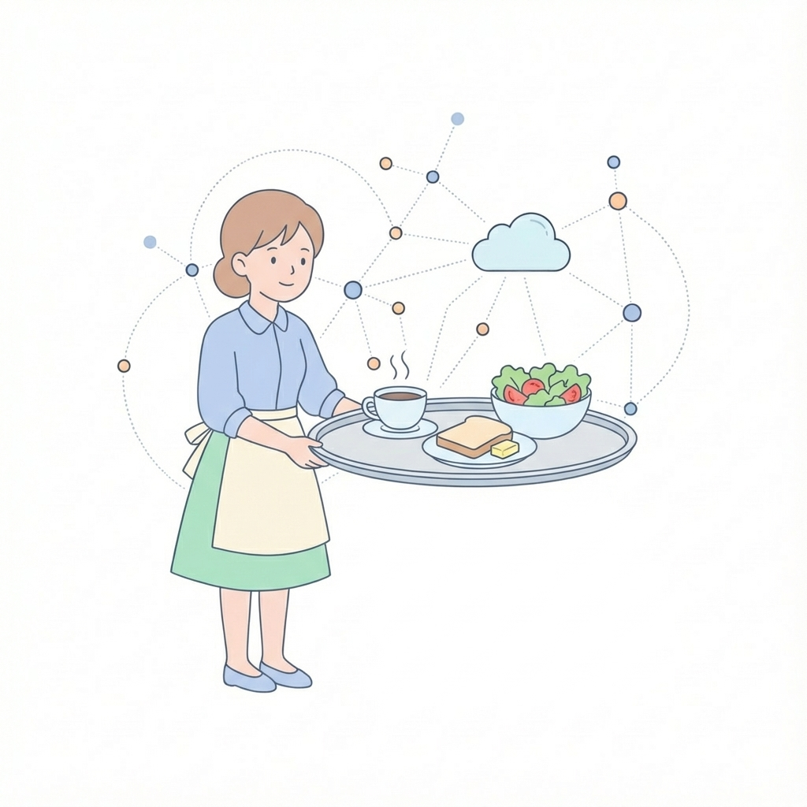
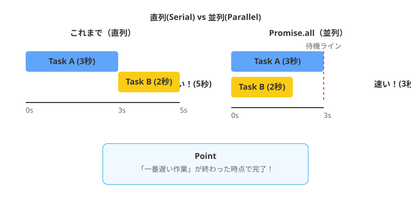

シリーズ第9回、**Day 9** のコンテンツです。
昨日の `try...catch` で、エラーが起きても大丈夫な「強いアプリ」になりました。
でも、人間とは欲深いもの。次は **「もっと速くしたい！」** と思うようになります。

今日は、複数の待ち時間（非同期処理）を **「同時進行（並列）」** させて、劇的に時間を短縮するテクニック **`Promise.all`** を学びます。
これを覚えると、アプリの体感速度が爆上がりしますよ！

-----

# 🕰️ Day 9：並行処理のテクニック ～Promise.all～

## 🐢 9.1 「ひとつずつ」は丁寧だけど遅い

まずは、Day 7で覚えた `await` を使って、2つの仕事をこなすシーンを想像してみましょう。

**【ミッション】**

1.  **ユーザー情報** を取得する（3秒かかる）
2.  **友達リスト** を取得する（2秒かかる）
3.  両方揃ったら画面に出す

### 今までの書き方（直列処理）

```javascript
async function loadMyPage() {
    console.time('かかった時間'); // 時間計測スタート！

    // 1. ユーザー情報を取る（3秒待つ）
    const user = await getUser();
    console.log('👤 ユーザー取れた！');

    // 2. 友達リストを取る（2秒待つ）
    const friends = await getFriends();
    console.log('👥 友達取れた！');

    console.log(`✨ 完成！ ${user.name}さんと、友達${friends.length}人`);
    console.timeEnd('かかった時間'); // 時間計測ストップ！
}
```

### 🧠 初心者さんの、心の旅

  * 「えーっと、3秒待って…よし完了。」
  * 「次に2秒待って…よし完了。」
  * 「合計で… **3秒 + 2秒 = 5秒** かかったね。」
  * 「うーん、丁寧だけど、ちょっと待ちくたびれちゃうな。友達リストを取るのに、ユーザー情報が終わるのを待つ必要あるのかな？」

そうなんです！ この2つの仕事は **お互いに関係がない（独立している）** ので、順番待ちをする必要がないんです。

-----

## 🏎️ 9.2 「せーの！」で同時に頼む ～Promise.all～

カフェで例えるなら、さっきのコードは **「コーヒーを頼んで、受け取ってから、トーストを頼む」** ようなものです。非効率ですよね？
普通は **「コーヒーとトースト、両方ください！」** とまとめて注文します。

それを実現するのが、**`Promise.all`（プロミス・オール）** です！

### 書き方のルール

1.  `await` を個別に書かない（注文だけ先に通す）。
2.  `Promise.all([ ... ])` の中に、待ちたいものを配列で全部入れる。
3.  `Promise.all` 自体に `await` をかける。



<!-- end list -->

```javascript
async function loadMyPageFast() {
    console.time('爆速タイム');

    // 1. ここでは「await」しない！ 注文だけ先に通す（リクエスト発射！）
    // チケット（Promise）だけもらって、手元に置いておく
    const userPromise = getUser();       // 3秒の処理
    const friendsPromise = getFriends(); // 2秒の処理

    console.log('🚀 両方同時に注文しました！');

    // 2. Promise.allを使って「全部揃うまで待て！」
    // 戻り値は、配列で順番通りに返ってくる
    const [user, friends] = await Promise.all([userPromise, friendsPromise]);

    console.log(`✨ 完成！ ${user.name}さんと、友達${friends.length}人`);
    console.timeEnd('爆速タイム');
}
```

### 🧠 初心者さんの、心の旅

  * 「結果は… **3秒** ！？ ええっ！？」
  * 「そうか！ 『ヨーイドン』で同時にスタートしてるから、**一番遅い方（3秒）が終わった時点で、両方揃ってる**ことになるんだ！」
  * 「2秒の方は、途中で終わってるけど、3秒の方が終わるまで一緒に待っててくれるんだね。」

### 🖼️ 直列 vs 並列（ガントチャート）

```mermaid
gantt
    dateFormat  s
    axisFormat  %s秒
    title 直列（awaitの連続） vs 並列（Promise.all）

    section 直列 (5秒)
    ユーザー取得 (3秒)      :a1, 0, 3s
    友達取得 (2秒)          :after a1, 2s

    section 並列 (3秒)
    ユーザー取得 (3秒)      :b1, 0, 3s
    友達取得 (2秒)          :b2, 0, 2s
```





これだけで、アプリの待ち時間が **5秒 → 3秒** に短縮されました。
もし仕事が10個あったら…効果は絶大ですよね！

-----

## ⚠️ 9.3 お盆をひっくり返さないで！

`Promise.all` は強力ですが、一つだけ弱点（というか特徴）があります。
それは、 **「一蓮托生（いちれんたくしょう）」** だということです。

カフェで、コーヒーとトーストを一つのお盆に乗せて運んでくるところを想像してください。
もし、運んでいる途中で**コーヒーをこぼしてしまったら（エラー発生）**、どうなりますか？

トーストが無事でも、店員さんは **「申し訳ありません！ 作り直します！」と言って、お盆ごと全部下げてしまいます。**


### ルール：一つでも失敗したら、即エラー

`Promise.all` の中に入れた処理が、**一つでも「失敗（Reject）」すると、他の処理が成功していても、全体が `catch` に飛んでしまいます。**

```javascript
try {
    const results = await Promise.all([
        getImportantData(), // 成功
        getErrorData()      // 失敗💥
    ]);
} catch (error) {
    console.log('😭 全滅です…成功したデータも受け取れません');
}
```

「成功したものだけでも欲しい！」という場合は、もっと高度な技（`Promise.allSettled`）がありますが、まずは **「`Promise.all` は全員成功が条件のチームプレー」** と覚えておけばOKです。

-----

<br>
<br>
<br>

## 🦑オクト・シェフ🦑 ショートクタイカの再来


### 💬 「手は8本あるんだ。一つずつ頼むのはやめてくれ。<br>　 　 皿回し、野菜切り、煮込み…全部まとめて言ってみな？<br>　 　 『同時に』終わらせて、一皿のコースにして出すぜ🦑」

<br>
<br>
<br>

-----

<br>
<br>
<br>

-----

## ✅ Day 9 のまとめ

今日は、複数の仕事を効率よくさばくためのテクニックを学びました。

1.  **直列処理（`await` の連続）** ：
      * 丁寧だけど、前の仕事が終わるまで次が進まない。「足し算」の時間（3秒+2秒=5秒）がかかる。
2.  **並列処理（`Promise.all`）** ：
      * 複数の仕事を「せーの」で開始する。
      * **「一番遅い仕事」の時間（3秒）だけで済む！**
3.  **注意点** ：
      * 一つでもコケたら、連帯責任で全部エラーになる（catchに飛ぶ）。

これで、非同期処理の基本技（待つ、エラー対応、並列化）はコンプリートです！
あなたはもう、JavaScriptの時間を自在に操れる「時の魔術師」です🧙‍♀️

明日からは、いよいよ **Part 3**。
この魔術を使って、**「自分のPCの外側（インターネット）」からデータを取ってくる冒険、`fetch()` API** の世界へ飛び込みます。

「今日の天気は？」「最新のニュースは？」
あなたのアプリが、世界と繋がる瞬間です。お楽しみに！

-----

<h1><a href="D10.md">Day10 へ</a></h1>


