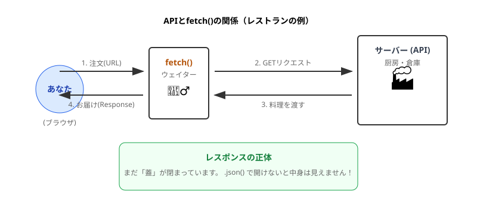
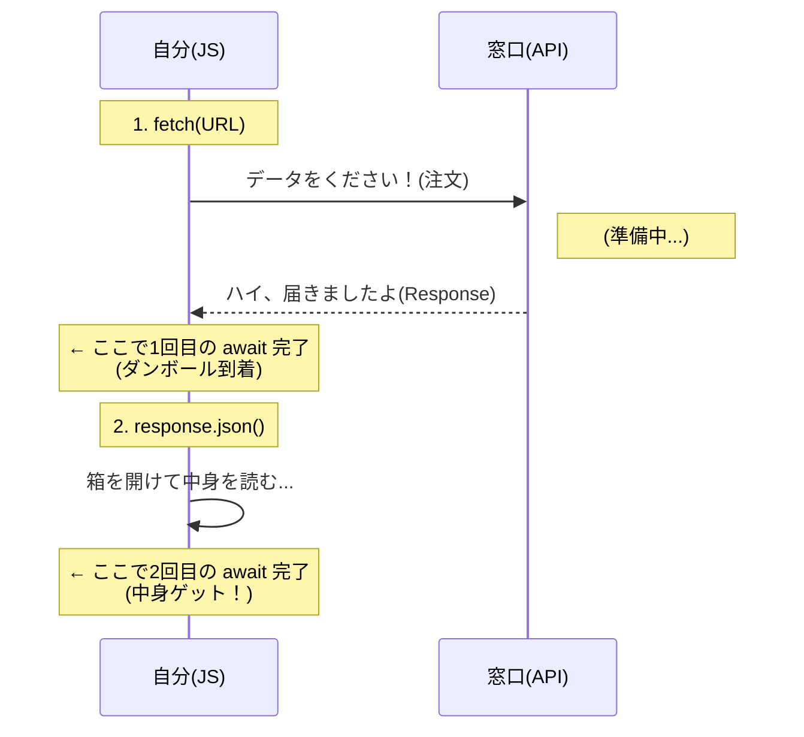
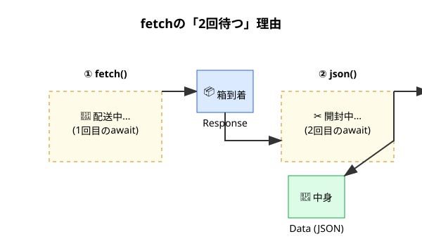

シリーズ第10回、**Day 10** のコンテンツです。
いよいよ **Part 3** に突入です。ここからは、自分のPC（ブラウザ）を飛び出して、**インターネットの向こう側**にあるデータを取ってくる冒険が始まります。

今日のテーマは、Webアプリ開発で最もワクワクする瞬間の一つ、 **「API通信（GETリクエスト）」** です。
世界中の天気、株価、地図、画像…あらゆるデータにアクセスするための「魔法の鍵」を手に入れましょう！

-----

# 🕰️ Day 10：世界への扉を開く ～GETリクエスト～

## 🌍 10.1 アプリが「世界」とつながる日

今まで作ってきたアプリは、データ（運動記録）を `localStorage` に保存していましたね。
これは、いわば **「自分の机の引き出し」** に日記をしまっている状態です。自分しか見れないし、他の人が書いたデータも見れません。

でも、世の中のアプリは違います。
「今日の天気は？」「最新のニュースは？」「カワイイ犬の画像は？」
これらは全部、 **インターネットの向こう側にある「サーバー」** という巨大な倉庫から、データを取ってきて表示しています。

この「倉庫からデータを取ってくる」行為を、 **「通信（Fetch：フェッチ）」** と呼びます。

-----

## 💁‍♂️ 10.2 APIってなに？ ～注文の窓口～

データを取ってくると言っても、勝手にGoogleのサーバーに入り込んでデータを盗むわけにはいきません（それはハッキングです👮）。
データを配っているサイトは、必ず **「ここから注文してね」という専用の窓口** を用意しています。

それが **API（エー・ピー・アイ）** です。

  * **正式名称：** Application Programming Interface
  * **イメージ：** レストランの「注文カウンター」や「メニュー表」

私たちは、このAPIという窓口に向かって、
「すいません（GET）、犬の画像を一枚ください（リクエスト）！」
とお願いするだけでいいんです。



-----


---

## 🐶 10.3 魔法の道具 `fetch()`

JavaScriptには、この「お願い」をするための専用の関数が用意されています。
その名もズバリ、**`fetch()`（取ってくる）** です。
（犬にボールを投げると「Fetch\!（取ってこい！）」と言いますよね。あれと同じです🐶）

では、世界で一番有名な「犬の画像API（Dog CEO API）」を使って、実験してみましょう。
このURLにアクセスすると、ランダムな犬の画像データがもらえます。
`https://dog.ceo/api/breeds/image/random`

### 実験コード（コンソールで実行！）

Day 7で覚えた `async/await` を使って書きますよ！

```javascript
async function getDog() {
    console.log('🐶 犬の画像を取りに行きます...');

    // 1. 窓口（URL）に行って、データを取ってくる
    // 「await」を忘れずに！（通信には時間がかかるからね）
    const response = await fetch('https://dog.ceo/api/breeds/image/random');

    // 2. 届いた箱を開けて、中身（JSON）を取り出す
    // あれ？ ここにも「await」があるぞ…？（後で解説！）
    const data = await response.json();

    console.log('📦 届いたデータ:', data);
    console.log('📷 画像のURL:', data.message);
}

getDog();
```

### 🧠 初心者さんの、心の旅

  * 「おおっ！ コンソールに `{ message: "https://...", status: "success" }` って出た！」
  * 「この `https://...` ってURLをブラウザの新しいタブで開いたら…わぁ！ 本当にワンちゃんの写真が出た！」
  * 「自分のPCには画像なんて入ってないのに、ネットから取ってきたんだ。感動…！」

-----

## 📦 10.4 なぜ `await` が2回あるの？

さて、ここで鋭い人は気づいたはずです。
「なんで `fetch` で待ったのに、`response.json()` でもっかい待たされるの？」

```javascript
const response = await fetch(...); // 1回目の待て
const data = await response.json(); // 2回目の待て
```

これは、 **「ネットショッピングの宅配便」** を想像すると完璧に理解できます。

### 🚚 1回目の await： `fetch()`

  * **状況：** ピンポーン！「お届けものでーす！」と配達員さんが玄関に来た。
  * **意味：** サーバーとつながって、**「返事が返ってきた（Response）」** という状態。
  * **中身：** まだダンボール箱（Responseオブジェクト）の状態です。中身が「注文通りの品」なのか「空っぽ（エラー）」なのかは、まだ分かりません。

### ✂️ 2回目の await： `response.json()`

  * **状況：** ダンボール箱のガムテープを切って、**中身を取り出す作業**。
  * **意味：** 届いたデータ（ストリーム）を、JavaScriptで扱える **「オブジェクト（JSON）」に変換する** 時間。
  * **理由：** 画像や動画のような大きなデータだと、読み込むのに少し時間がかかるため、ここでも「待て（await）」が必要なんです。

### 🖼️ 2段階認証の図（シーケンス図）






だから、`fetch` を使うときは、**「届くのを待つ」→「開けるのを待つ」という2段構え**が基本セットだと覚えておきましょう！

-----

<br>
<br>
<br>

## 🐕ペリカン便のペリー🐕 お届けは迅速に


### 💬 「お届けものです！ ハンコください！<br>　 　 え？ 中身？ それは開けてからのお楽しみ。<br>　 　 私は『届ける』までが仕事ですから📦」

<br>
<br>
<br>

-----

## ✅ Day 10 のまとめ

ついに、アプリがインターネットとつながりました！

1.  **API（窓口）** ： データを配ってくれる場所。URLで指定する。
2.  **`fetch()`** ： データを取ってくる関数。時間がかかるから `await` する。
3.  **2回待つ** ：
      * 1回目：`await fetch(...)` ＝ 荷物が届くのを待つ。
      * 2回目：`await response.json()` ＝ 箱を開けてデータを読むのを待つ。

「データは取れたけど、コンソールに出してもユーザーには見えないよね？」

その通り！
明日は、この取ってきたデータを、Day 9までで作った「DOM操作」の技術と組み合わせて、 **「画面にワンちゃんの画像を表示するアプリ」** を作ります。

さらに、データが届くまでの間に **「読み込み中…（グルグル）」** を表示して、ユーザーを安心させるテクニックも伝授しますよ！

-----

<h1><a href="D11.md">Day11 へ</a></h1>


