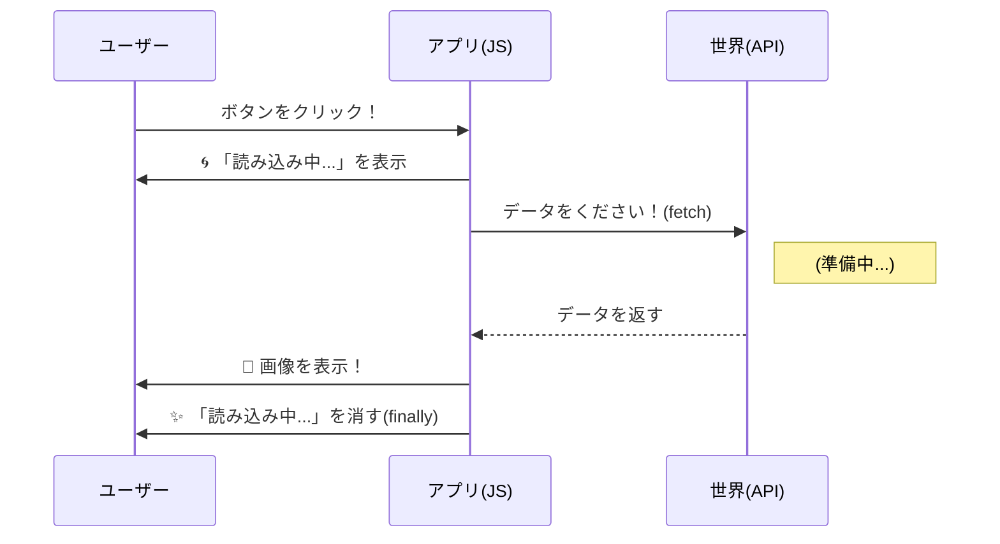

シリーズ第11回、**Day 11** のコンテンツです。
昨日は `fetch()` を使って、インターネットの向こう側からデータ（JSON）を取り寄せることに成功しました。
でも、そのデータはまだコンソールの中にしかありません。

今日は、そのデータを\*\*「料理（加工）」**して、ユーザーが見える**「お皿（ブラウザの画面）」\*\*に盛り付ける工程を学びます。
さらに、データが届くまでの待ち時間を「おもてなし」に変える、プロの気配りテクニックも登場しますよ！

-----

# 🕰️ Day 11：取得したデータを画面に出す ～UIへの反映～

## 🍳 11.1 素材は揃った！あとは盛り付けだけ

昨日の実験で、犬の画像APIからこんなデータが届きましたね。

```json
{
    "message": "https://images.dog.ceo/.../terrier.jpg",
    "status": "success"
}
```

この `message` の中に入っているURL。
これを、HTMLの `` の中に入れてあげれば、画面にワンちゃんが表示されるはずです。

Day 9までで作った「運動記録アプリ」で、`innerHTML` や `value` を書き換えたのを覚えていますか？
やることはあれと全く同じです！

1.  **データを取り寄せる（fetch）**
2.  **表示する場所を探す（getElementById）**
3.  **書き換える（src = ...）**

この3ステップで、アプリは完成します。

-----

## 🐶 11.2 ワンちゃん表示アプリを作ろう

では、実際にコードを書いてみましょう。
HTMLファイルに、画像を表示するための「枠」を用意します。

### HTML

```html
<h1>きょうのわんこ🐶</h1>
<button id="fetch-btn">新しい写真を見る！</button>

<div id="dog-container">
    
</div>
```

### JavaScript

```javascript
// 1. ボタンと画像の要素を見つけておく
const btn = document.getElementById('fetch-btn');
const img = document.getElementById('dog-image');

// 2. データを取ってきて表示する関数
async function showDog() {
    console.log('🚀 データを注文しました...');
    
    // APIからデータを取る（2段階待機！）
    const response = await fetch('https://dog.ceo/api/breeds/image/random');
    const data = await response.json();

    console.log('📦 データ到着！ URL:', data.message);

    // 3. 画像の src を書き換える（盛り付け！）
    img.src = data.message;
}

// ボタンを押したら実行！
btn.addEventListener('click', showDog);
```

### 🧠 初心者さんの、心の旅

  * 「ボタンをポチッ！ …（一瞬の間）… わっ！ 写真が出た！」
  * 「コンソールにあった文字（URL）を、`img.src` に代入するだけで、ブラウザが勝手に画像を読み込んでくれるんだ。」
  * 「なんか私、本当に『アプリ』を作ってる感じがする…！」

-----

## ⏳ 11.3 「空白の時間」を埋めるおもてなし

さて、ここで一つ問題があります。
インターネットが遅い場所でこのボタンを押すと、どうなるでしょうか？

1.  ボタンを押す。
2.  **（……シーン……）**
3.  3秒後、急に画像が切り替わる。

この「シーン」としている間、ユーザーは\*\*「あれ？ ボタン押せてないかな？」\*\*と不安になって、何度もボタンを連打してしまうかもしれません。

そこで大切なのが、\*\*「ローディング表示（Loading State）」\*\*です。
「ただいま準備中です！」という看板を出すだけで、ユーザーは安心して待つことができます。

### 🌀 ローディングの仕組み

1.  処理が始まったら、**「読み込み中…」を表示**する。
2.  `await` でデータを待つ。
3.  終わったら、**「読み込み中…」を消す**。

ここで役に立つのが、Day 8で習った **`finally`（ファイナリー）** です！

-----

## 🛡️ 11.4 実践！ローディング付きのコード

HTMLに「読み込み中」のメッセージを追加して、JavaScriptで出し入れしてみましょう。

### HTML（追加）

```html
<p id="loading-text" style="display: none;">⏳ 読み込み中... 準備してます！</p>
```

### JavaScript（改良版）

```javascript
const loadingText = document.getElementById('loading-text');

async function showDogSafe() {
    // 1. 看板を出す（表示オン！）
    loadingText.style.display = 'block';
    
    try {
        // データを取る
        const response = await fetch('https://dog.ceo/api/breeds/image/random');
        const data = await response.json();
        
        // 画像をセット
        img.src = data.message;

    } catch (error) {
        // エラーの時はアラートを出す
        alert('ごめんなさい！ 通信エラーです🐶💦');
        
    } finally {
        // 3. 成功しても失敗しても、最後に必ず看板を片付ける（表示オフ！）
        loadingText.style.display = 'none';
    }
}

btn.addEventListener('click', showDogSafe);
```

### 🧠 初心者さんの、心の旅

  * 「ボタンを押すと、『⏳ 読み込み中...』がパッと出てくる！」
  * 「で、写真が出ると同時に消えた！」
  * 「これがあるだけで、『ちゃんと動いてるんだな』って安心感が全然違うね。」
  * 「`finally` って、このためにあったんだ…。お掃除係、超重要じゃん！」

### 🖼️ おもてなしのフロー（シーケンス図）



-----

<br>
<br>
<br>

## 🤵‍♂️執事スピナー🤵‍♂️ お待ちいただく時間の魔術師

\

### 💬 「お客様をお待たせする時は、『ただいま準備中』とお伝えするのが礼儀でございます。<br>　 　 私がクルクルと回っている間は、どうぞ安心してお待ちくださいませ。<br>　 　 フリーズしたわけではございませんよ🤵‍♂️」

<br>
<br>
<br>

-----

## ✅ Day 11 のまとめ

今日は、取ってきたデータを「ユーザーに見せる」技術を学びました。

1.  **盛り付け** ： APIから届いたデータ（JSON）を、`img.src` や `div.textContent` に代入して画面を作る。
2.  **おもてなし（UX）** ： `fetch` は時間がかかるので、必ず「ローディング表示」をする。
3.  **`finally` の活用** ： 成功してもエラーになっても、最後に必ずローディングを消すために使う。

これで、あなたのアプリは「データを取ってきて、親切に表示する」ことができるようになりました。
いわば\*\*「テレビ（受信専用）」\*\*の状態です。

でも、Webアプリの本当の楽しさは、\*\*「自分のデータを送る（発信）」**ことにあります。
明日は、あなたのアプリからサーバーに向かってデータを投げ込む、**「POSTリクエスト」\*\*に挑戦します。

「荷物に宛名を書いて、トラックに乗せる」
そんな新しい冒険が待っています。お楽しみに！

-----

\<h1\>\<a href="D12.md"\>Day12 へ\</a\>\</h1\>
