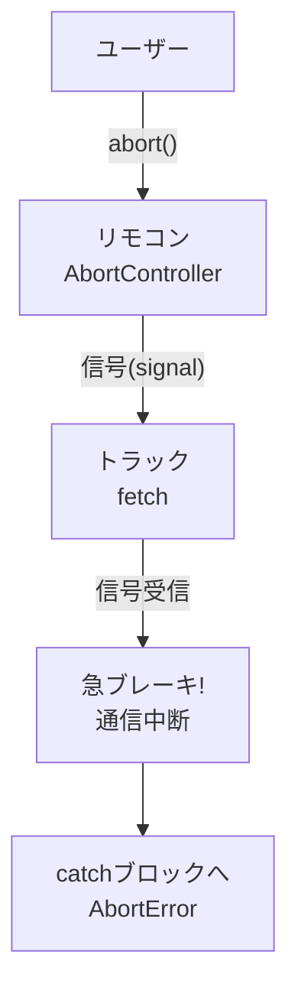

シリーズ最終回、**Day 13** のコンテンツです。
13日間にわたる「非同期処理」の旅、ついにゴールです！

最後は、プロのエンジニアなら必ずケアしている **「想定外のトラブル」** への対処法です。
「ページが見つかりません（404）」や「通信中にキャンセルされた」といった状況でも、アプリを壊さずに、スマートに振る舞うための **「大人のマナー」** を身につけましょう。

これで、あなたのアプリはどんな時でも動じない「堅牢（けんろう）」なものになります！

-----

# 🕰️ Day 13：トラブル対応とキャンセル ～堅牢な通信～

## 🚦 13.1 サーバーの「機嫌」を知る ～ステータスコード～

Day 12で、サーバーにデータを送ったりもらったりしました。
このとき、サーバーはデータと一緒に **「ステータスコード」** という3桁の番号を返してきます。
これは、サーバーからの **「今の状況報告」** です。

全部覚える必要はありません。信号機のように **3つの色（番号帯）** だけ覚えればOKです！

### 🟢 200番台：成功（Green）

  * **200 OK** ： バッチリ！ 正常終了です。
  * **201 Created** ： POSTで新しいデータが作られました。

### 🟡 400番台：あなたのミス（Yellow/Red）

  * **400 Bad Request** ： データの形式が間違っています（荷札の貼り忘れなど）。
  * **401 Unauthorized** ： ログインしてません（会員証がない）。
  * **404 Not Found** ： そんなページ（データ）はありません。

### 🔴 500番台：サーバーのミス（Red）

  * **500 Internal Server Error** ： サーバー内部で火事（エラー）が起きています。ごめんね。

`fetch` した後は、まずこの番号を見て、「成功したか？」を判断するのが基本です。

-----

## 😱 13.2 `fetch` の落とし穴 ～404は「成功」！？～

ここで、多くの初心者がハマる**巨大な落とし穴**があります。
以下のコードを見てください。

```javascript
try {
    // 存在しないURL（404）にアクセス！
    const response = await fetch('https://api.example.com/daremoc-inai-yo');
    console.log('やったー！ catchに行かずにここに来たよ！');

} catch (error) {
    console.log('エラーだ！ 404だからここに来るはず！');
}
```

「404 Not Found（見つからない）」なんだから、当然 `catch` ブロック（エラー）に行くと思いますよね？

**実は、`try` の中（成功ルート）を通ってしまうんです！**

### なぜ！？

`fetch` にとっての「成功」とは、 **「サーバーと無事にお話ができたこと」** だからです。
「404（ありません）」という返事が返ってきたということは、 **「サーバーと会話は成立した（＝通信成功）」** とみなされるのです。

### ✅ 正しいチェック方法：`response.ok`

本当の「成功（200番台）」かどうかを知るには、`response.ok` というプロパティを使います。

```javascript
const response = await fetch(URL);

// もし「成功（200-299）」じゃなかったら...
if (!response.ok) {
    // 自分でエラーを投げて、catchに飛ばす！
    throw new Error(`サーバーエラーです！ コード: ${response.status}`);
}

// ここまで来たら本当の成功！
const data = await response.json();
```

### 🧠 初心者さんの、心の旅

  * 「ええーっ！ トラック（fetch）は、荷物が『空っぽの箱』でも、届ければ『仕事完了！』って顔するんだ。」
  * 「だから、箱を開けて『納品書（response.ok）』を確認して、ダメだったら自分で『不良品だー！』って叫ばなきゃいけないんだね。」
  * 「これが『手動でエラーを投げる（throw）』ってことか…！」

-----

## 🛑 13.3 「やっぱりやめた！」 ～AbortController～

最後に、ちょっとカッコいい上級テクニック **「キャンセル処理」** を学びましょう。

**【シーン】**

1.  ユーザーが「検索」ボタンを押す。
2.  通信に5秒かかる。
3.  ユーザーが待ちきれずに **「閉じる」ボタンを押した**。

このままだと、裏側で通信が走り続け、5秒後に「検索完了！」と画面を出そうとして、**「もう画面がないよ！」とエラー**になってしまいます。

これを防ぐには、 **「通信中止（アボート）スイッチ」** を作ります。
それが **`AbortController`（アボート・コントローラー）** です。

### 書き方の手順

1.  **コントローラー（リモコン）** を作る。
2.  **シグナル（受信機）** を `fetch` に渡す。
3.  止めたい時に `controller.abort()` を呼ぶ。

<!-- end list -->

```javascript
// 1. リモコンを作る
const controller = new AbortController();

async function searchData() {
    try {
        console.log('📡 通信スタート...');

        // 2. fetchに「このシグナルで監視してね」と渡す
        const response = await fetch('https://slow-api.com/data', {
            signal: controller.signal
        });
        
        const data = await response.json();
        console.log('✅ データ到着！', data);

    } catch (error) {
        // 3. キャンセルされた時は、特別なエラーが出る
        if (error.name === 'AbortError') {
            console.log('🛑 ユーザーによってキャンセルされました');
        } else {
            console.log('😭 普通のエラー:', error);
        }
    }
}

// --- 3秒後に「やっぱりやめた！」とする ---
setTimeout(() => {
    console.log('😡 遅い！ キャンセルだ！');
    controller.abort(); // スイッチオン！
}, 3000);

searchData();
```

### 🖼️ キャンセルの仕組み（イメージ図）



これを入れておけば、ユーザーが画面を閉じたり連打したりしても、古い通信をピタッと止めることができる **「お行儀の良いアプリ」** になります。

-----

<br>
<br>
<br>


## 🚦シグナル・シスターズ🚦 通信の交通整理人


### 💬 「青（200）なら進め！ 赤（500）なら止まれ！<br>　 　 黄色（404）でも止まるのよ。<br>　 　 そして『Abort』の笛が鳴ったら、<br>　 　 たとえゴール直前でも回れ右！ これが通信の交通ルールよ🚦」

<br>
<br>
<br>

-----

<br>
<br>
<br>

## 🪧 求人募集中のワンオペ座支配人


### 💬 「交通整理はできた。だが舞台袖はまだ私一人…限界だ！<br>　 　 明日からは別室に助っ人を雇う。Web Worker の求人広告、貼っておくぞ📢」

<br>
<br>
<br>

-----

## ✅ 13日間の旅の終わり：あなたへ

お疲れ様でした！ これで「JavaScriptの『時間』を操る！非同期処理・集中講座」、全13日間が終了です。

振り返ってみましょう。

1.  **Day 1-2：** JSは「ワンオペ」だと知り、「タイマー」で時間をずらす遊びをしました。
2.  **Day 3-4：** 「イベントループ」の秘密を知り、「コールバック地獄」でもがきました。
3.  **Day 5-7：** **`Promise`** と **`async/await`** という魔法を手に入れ、時間を止められるようになりました。
4.  **Day 8-9：** エラーに対応し、並行処理で時間を短縮しました。
5.  **Day 10-12：** **`fetch`** で世界とつながり、データを送受信しました。
6.  **Day 13：** ステータスコードとキャンセル処理で、プロ品質の堅牢さを身につけました。

今のあなたはもう、「動かない…」と呆然とする初心者ではありません。
**「なぜ動かないのか（待っていないからか？ エラーか？）」** を推測し、 **「どうすれば動くか（awaitするか？ try-catchするか？）」** を知っているエンジニアです。

ここから先は、あなたの作りたいものを自由に作ってください。
天気予報アプリ、チャットアプリ、画像検索アプリ…
インターネットの向こう側には、無限のデータが待っています。

…と言いたいところですが、実はもう一つだけ、
**「どうしても教えたい魔法（技術）」** が残っているのです。

それは、シェフ（JavaScript）が長年抱えてきた「孤独」を救う、禁断の秘術…。

<h1><a href="D14.md">Day 14 へ進む</a></h1>
