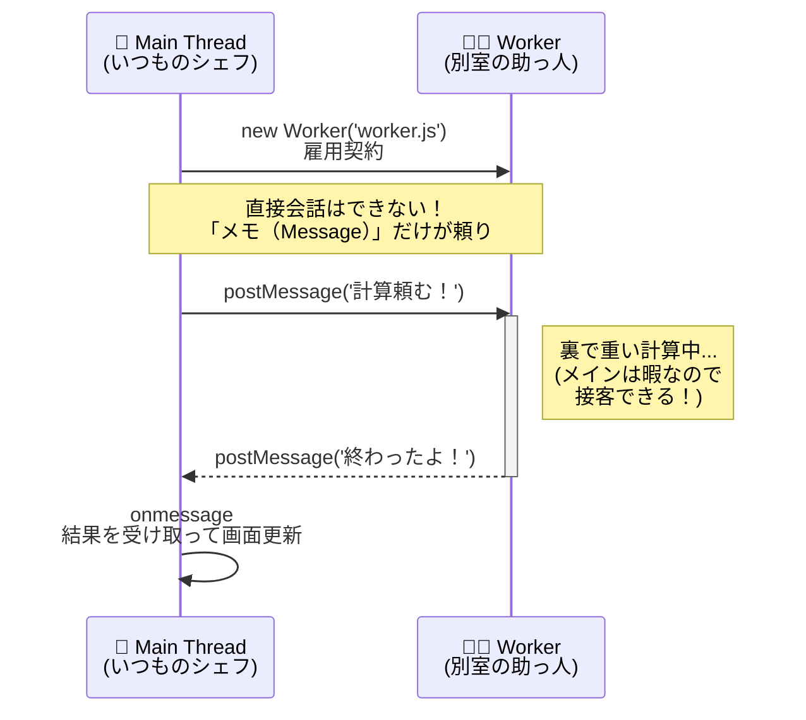

シリーズ14日目、**Day 14** のコンテンツです。
物語は終わったと思いましたか？ 実は「番外編」として、もう一つの重要なトピックが残っています。

これまで私たちは、「JavaScriptはワンオペ（シングルスレッド）だから、待たせてはいけない」と何度も繰り返し学んできました。
しかし、最新のJavaScriptには、ついに **「助っ人」** を呼ぶ機能が搭載されたのです。

今日は、その助っ人 **「Web Worker（ウェブ・ワーカー）」** との出会いです。

-----

# 🕰️ Day 14：もう一人の自分 ～Web Worker～

## 👯 14.1 シェフは孤独…じゃなかった！？

思い出してください。Day 1からDay 13まで、私たちのシェフ（メインスレッド）は、たった一人で注文を聞き、料理を作り、皿を洗ってきました。

> **「重い計算（無限ループなど）をすると、画面がフリーズする」**

これは、シェフが料理にかかりきりで、お客さん（ユーザー）の注文（クリックなど）を聞けなくなるからでした。
だからこそ、「非同期処理（後でやる）」を使って、待ち時間を有効活用してきたわけです。

しかし、もし **「別のキッチン」** があって、そこに **「もう一人のシェフ」** がいたらどうでしょう？

「おい、この計算だけやっといてくれ！」と頼んで、自分はお客さんの接客に集中できるとしたら……？

それが、**Web Worker（ウェブ・ワーカー）** です。

### 🍳 Web Worker の特徴：別室の助っ人

1.  **別スレッド（マルチスレッド）：**
    メインのシェフとは完全に別の **「パラレルワールド（別スレッド）」** で動きます。
2.  **UIには触れない：**
    助っ人は「別室」にいるので、ホールの様子（DOM/HTML）は見えません。
    `document.getElementById` や `alert` は使えません。計算専用です。
3.  **会話は「メモ」だけ：**
    メインのシェフと助っ人は、直接会話できません。
    **「メッセージ（データをコピーしたメモ）」** をやり取りすることで連携します。

### 🖼️ 仕組みのイメージ



-----

## 🧪 14.2 実験：フリーズを回避せよ！

実際に動かして体験してみましょう。

### 😱 普通に重い処理をすると…

まず、メインスレッドで「30億回足し算する」という無駄に重い処理を書いてみます。

```javascript
document.getElementById('heavy-btn').addEventListener('click', () => {
    console.log('計算開始...');
    
    // メインスレッドで計算（ブロッキング）
    let sum = 0;
    for (let i = 0; i < 3000000000; i++) {
        sum += i;
    }
    
    console.log('計算終了！ 結果:', sum);
});
```

このボタンを押すと、計算が終わるまでの数秒間、**画面は完全にフリーズします**。
他のボタンも押せないし、文字の入力もできません。最悪です。

### ✨ Worker に頼むと…

では、この計算を「助っ人（Worker）」に丸投げしてみましょう。

#### 1. 助っ人の台本を作る (`worker.js`)

まず、別ファイル（重要！）に、助っ人にやらせたい仕事を詳しく書きます。

```javascript
// worker.js （これは別室のキッチンです）

// ■ メインからの依頼（メッセージ）を待つ
self.onmessage = function(event) {
    console.log('Worker: 「依頼が来たぞ！ 内容は...」', event.data);

    // 重い計算を実行！
    let sum = 0;
    for (let i = 0; i < 3000000000; i++) {
        sum += i;
    }

    // ■ 計算結果をメインに報告する（送り返す）
    // self.postMessage(送るデータ)
    self.postMessage(sum);
    console.log('Worker: 「計算完了。結果を送ったよ！」');
};
```

#### 2. メインから雇用する (`main.js`)

メインのシェフ側で、Workerを雇い（`new Worker`）、依頼を出します。

```javascript
// main.js （いつものメインキッチン）

const worker = new Worker('worker.js'); // 1. 雇用契約（読み込み）

// ■ 助っ人からの報告を受け取る準備
worker.onmessage = function(event) {
    const result = event.data; // event.data に結果が入っている
    console.log(`Main: 「助っ人から結果が届いた！ ${result} だね！」`);
};

// --- 重い処理ボタンが押されたら ---
document.getElementById('heavy-btn').addEventListener('click', () => {
    console.log('Main: 「おい助っ人、仕事だ！」');
    
    // ■ ここがポイント！
    // 処理を実行するのではなく、「やっておいて」とメッセージを送るだけ。
    // 引数には、渡したいデータを入れる（今回は特にないので空文字とかでOK）。
    worker.postMessage('start'); 
    
    console.log('Main: 「依頼完了。私は次のお客さんの対応に戻るよ。」');
});
```

### 実行結果

ボタンを押した瞬間：
1. `Main: 「依頼完了...」` が **一瞬で** 表示されます。
2. その直後から、あなたが画面の他のボタンを押したり、アニメーションを見たりしても、**全くカクつきません**。
3. 数秒後、忘れた頃に `Main: 「助っ人から結果が届いた！」` と表示されます。

これが **「並列処理（パラレル）」** の威力です！

-----

## 🧠 初心者さんの、心の旅

*   「えっ、JavaScriptって『ワンオペ』じゃなかったの！？ 騙された！」
*   「……いや、違うな。別の人間がいるわけじゃなくて、『計算専用のロボット』を別室で動かしてる感じか。」
*   「今までの `setTimeout` は『後回しにするだけ（結局自分がやる）』だったけど、これは『本当に同時に動いてる』んだ。」
*   「でも、DOM（画面）をいじれないなら、計算が終わったら結果をメインスレッドに戻して（postMessage）、メインスレッドが画面を更新しなきゃいけないのね。連携プレーだ！」

-----

## 📝 今日のまとめ

*   **Web Worker** は、メインスレッドとは別の場所で動くスクリプト。
*   **`new Worker('file.js')`** で作成する。
*   お互いに **`postMessage()`** で依頼し、 **`onmessage`** で受け取る。
*   Workerを使えば、どんなに重い計算をしても、UI（メインスレッド）は止まらない！

次回、もう一歩踏み込んで、この「並列ダンス」をより実践的に使いこなしてみましょう。

<h1><a href="D15.md">Day 15 へ進む</a></h1>
