シリーズ15日目、**Day 15** のコンテンツです。
今日は、前回手に入れた「助っ人シェフ（Web Worker）」をさらに使いこなし、ユーザーをおもてなしする **「究極の並列処理（パラレル・ダンス）」** を習得しましょう。

-----

# 🕰️ Day 15：並列処理のダンス ～重い計算を裏側で～

## 🕺 15.1 メインとサブの華麗な連携

前回、私たちは「計算用ロボット（Worker）」を雇いました。
しかし、ただ「計算して」と投げるだけではもったいない。

実際のアプリでは、もっと複雑な連携が必要になります。

*   **メインシェフ（UI）：** 「お客さん、お待ちの間こちら（ローディング画面）をご覧ください」
*   **助っ人シェフ（Worker）：** （裏で必死に計算）「終わりました！」
*   **メインシェフ（UI）：** 「はい、出来たて（計算結果）です！ お待たせしませんでしたね（UI止まってないし）」

この **「表の顔（接客）」** と **「裏の顔（重労働）」** を完全に分離することこそ、Web Workerの真骨頂です。

### 🖼️ 並列処理のダンス（イメージ図）

```mermaid
gantt
    %%{init: {'theme': 'neutral'} }%%
    title 【理想】メインとWorkerの並列ダンス
    dateFormat s
    axisFormat %s秒
    
    section Main Thread (UI)
    クリック受付      :done, m1, 0, 1
    ローディング表示   :active, m2, 1, 2
    ★キャンセル受付可能 :active, m3, 2, 5
    結果表示          :crit, m4, 5, 6

    section Web Worker (計算)
    重い計算(0-20%)   :active, w1, 1, 2
    重い計算(20-40%)  :active, w2, 2, 3
    重い計算(40-80%)  :active, w3, 3, 4
    重い計算(完了)    :active, w4, 4, 5
```



> **解説：** 下の `Web Worker` が青い帯（計算）で埋まっていても、上の `Main Thread` は隙間があるので、ユーザーの「キャンセル」クリック等に即座に反応できます。これが **「並列（パラレル）」** です。

-----

## 🛠️ 15.2 実践：画像処理シミュレーション

例えば、「画像のフィルタ加工」のような重い処理を想像してください。
これをメインスレッドでやると、加工中は「キャンセル」ボタンすら押せなくなります。

Workerを使って、**「加工中でもキャンセルできる（UIが生きている）」** 状態を作ってみましょう。

### 📄 worker.js （裏方）

```javascript
self.onmessage = function(event) {
    const jobName = event.data;
    console.log(`Worker: 「${jobName}の依頼だね。了解！」`);

    // 進行状況を報告しながら処理する（例）
    for (let i = 0; i <= 100; i += 20) {
        // 重い処理のフリ（0.5秒待つ）
        const start = Date.now();
        while (Date.now() - start < 500);

        // 途中経過をメインに報告！
        self.postMessage({ status: 'progress', value: i });
    }

    // 完了報告
    self.postMessage({ status: 'complete', result: '加工完了画像データ' });
};
```

### 📱 main.js （表方）

```javascript
const worker = new Worker('worker.js');

// 結果を受け取る
worker.onmessage = function(event) {
    const message = event.data;

    if (message.status === 'progress') {
        console.log(`Main: 進捗... ${message.value}%`);
        // ここでプログレスバーを動かせる！ UIは止まってないから滑らか！
    } else if (message.status === 'complete') {
        console.log('Main: ✨ 完成しました！');
    }
};

// 仕事を依頼
document.getElementById('start-btn').addEventListener('click', () => {
    worker.postMessage('セピア色変換');
});

// ★ここが大事！
// Workerが裏で動いていても、メインスレッドは暇なので、このボタンはいつでも押せる！
document.getElementById('cancel-btn').addEventListener('click', () => {
    console.log('Main: 「クビだ！ 処理中止！」');
    
    // 💀 強制終了（解雇）
    worker.terminate(); 
    console.log('Main: Workerを停止しました。');
});
```

### 🌟 何が起きているか？

1.  **プログレスバーがヌルヌル動く：**
    Workerから `postMessage` で「20%完了…」と届くたびに画面を更新できます。メインスレッドは計算していないので、描画もスムーズです。
2.  **いつでもキャンセル可能：**
    裏でどんなに重いループが回っていても、メインスレッドのクリックイベントは即座に反応します。
    `worker.terminate()` を呼べば、Workerはその瞬間に抹殺…いえ、停止されます。

これが、ユーザーにストレスを与えない **「ノンブロッキングなUI」** です。

-----

## 🛑 15.3 注意点：Workerの「制限」

助っ人は万能ではありません。彼らには厳格なルールがあります。

1.  **DOMには触れない：**
    前述の通り、`document` や `window` オブジェクトの一部にはアクセスできません。
    「画面の色を変える」などは、必ずメッセージを受け取った **メインスレッド** が行う必要があります。
2.  **渡すデータは「コピー」される：**
    メインからWorkerにオブジェクトを送るとき、それは「コピー」渡されます（構造化複製）。
    巨大なデータ（数百MBの画像など）をコピーすると、受け渡しだけで時間がかかることがあります。
    *※`Transferable Objects` という上級技で回避可能ですが、それはまた別の物語で。*
3.  **起動コストがかかる：**
    `new Worker()` は少し時間がかかります。クリックのたびに作るより、最初に作って使い回すのが基本です。

-----

## 📝 15日間のまとめ：時間の支配者

これで、非同期処理の旅は本当に終わりです。

*   **Day 1-4:** 基礎（setTimeout, コールバック）
*   **Day 5-9:** 応用（Promise, async/await）
*   **Day 10-13:** 通信（fetch）
*   **Day 14-15:** 並列（Web Worker）

あなたは今、**「時間をずらす（非同期）」** ことも、**「時間を重ねる（並列）」** ことも自由に操れるようになりました。
もはや、JavaScriptのシングルスレッドの制約は、あなたの敵ではありません。

この強大な力を、ユーザーの「心地よい体験」のために使ってください。

さあ、今度こそ最後のエンドロールへ！

<h1><a href="D16.md">エンドロールへ</a></h1>
