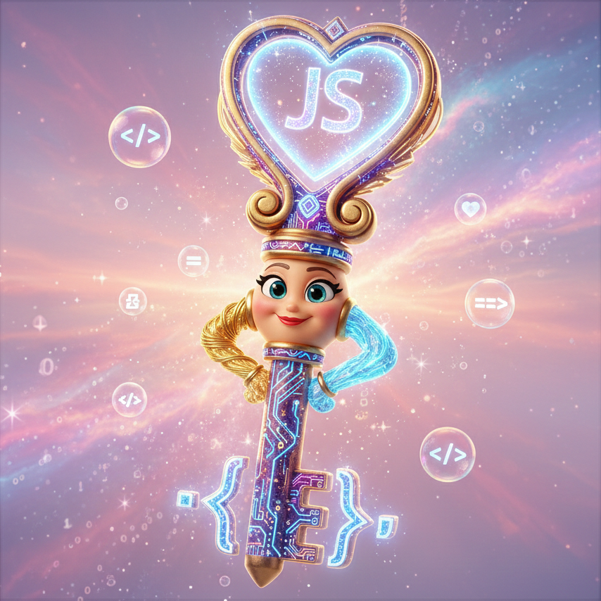

シリーズ最終回、**Day 16** のコンテンツです。  
15日間の長い旅路、本当にお疲れ様でした。  
これは、時間を操る魔法を習得したあなたへ贈る、最後のエンドロールです。

-----

# 🕰️ 時の鍵授与 🕰️ 恐ろしい前に神秘的なJSの時の鍵

 

   
   
   
   
 

   
   
   
   
   
   
   
   
   
 

# 💬 時の賢者からの言葉

 

 

