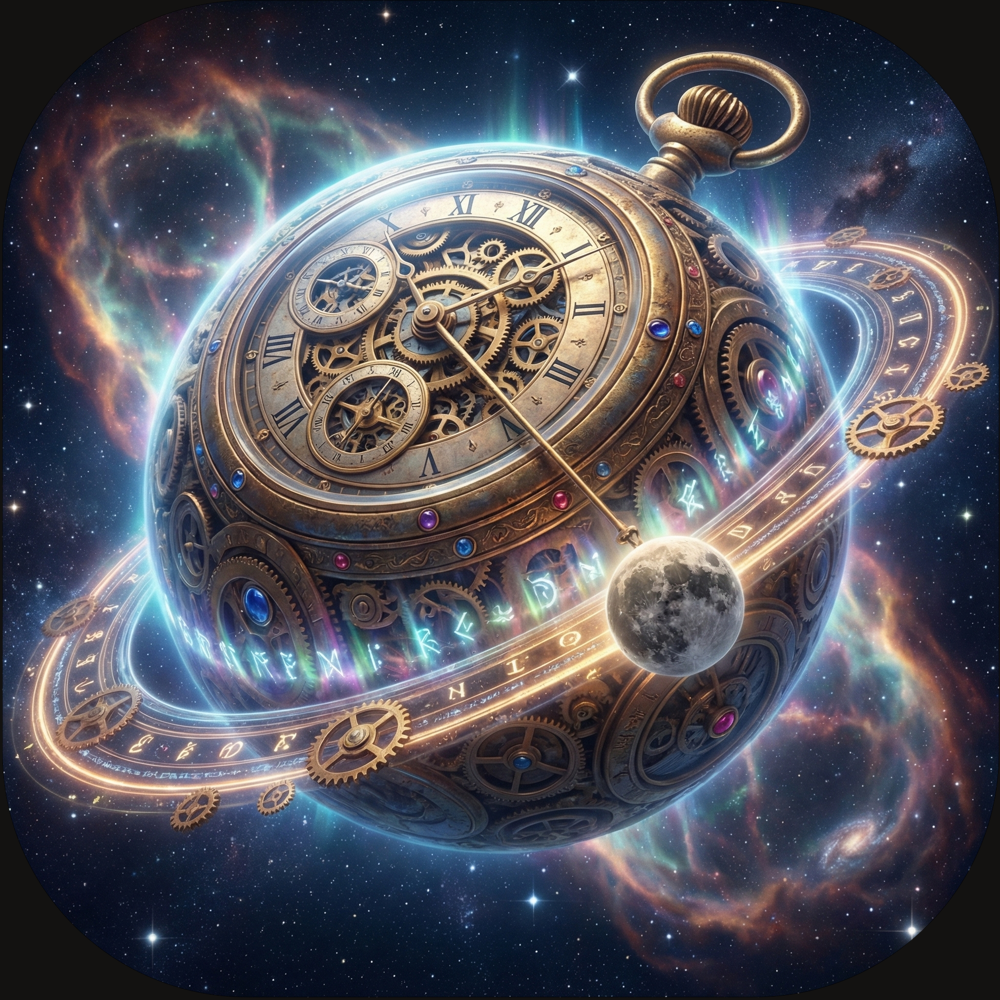

## ポセイ丼星の「とある日」に...

# プロローグ

「運動トラッカー」を完成させたイチカ丼。  
その後、`try`、`catch`、`finally`、`throw`...  
エラー処理という名の盾も手に入れ意気揚々。

そんなある日、突如「りんりん」が目の前に現れたのである。

**りんりん**：  
　「イチカ丼...久しぶりね。  
　　聞いたわよ、最近は絶好調だとか⏰️」

**イチカ丼**：  
　「えへへ、まあね！」

**りんりん**：  
　「でも...それは『普通の時間』の中での物語。  
　　あなたはまだ、本当の『時の流れ』を知らない⏰️」

**りんりん**：  
　「通信、待機、そして並列に動く世界...  
　　それを手にしたいなら、私の母星へ来なさい。  
　　**『時の星』** が、あなたを呼んでいるわ⏰️」

---

**ナレーター**：  
　「そして今、イチカ丼は新たな星へと旅立つ。  
　　そこで彼女を待ち受けるのは、完了を待たずに進む処理の嵐か、  
　　それとも約束（Promise）された未来か...？」

**ナレーター**：  
　「イチカ丼の新たな15日間が、今、始まる...！」

 
 
 

---

## イチカ丼

### 💬「ママ！ わたしね、『時の星』にしばらく行ってくる！ 　 　はじめての星の外への旅、もうワクワクが止まらないの！」

## ママ丼
 
 

### 💬「体には気をつけるのよ。 　 　毎日 『あるきあるき』 の練習するのよ？」

 
 
 

-----

# 🕰️ JavaScriptの「時間」を操る！非同期処理・集中講座

**ゴール：** タイマーの基礎から `async/await`、`fetch()`、Web Worker まで、Webで「時間」と「通信」を扱う力を15日で身につける。

## コースの全体像

- **Part 1：キッチンタイマーで学ぶ基礎編** - シングルスレッドとイベントループ、タイマー操作を体験。
- **Part 2：Promise / async/await** - コールバック地獄を整理し、読みやすい非同期コードを書く。
- **Part 3：fetch()で外部APIと通信** - GET/POST、エラーハンドリング、AbortController を使った堅牢な通信。
- **Part 4：Web Worker** - 重い計算を別スレッドに逃がし、UI を滑らかに保つ。

## 進め方

- 日別の詳細シナリオと課題は `D00.md` に集約しています。
- 教材は `D01.md` から `D16.md` を順番に進めてください。
- メタファーや用語の整理も `D00.md` でまとめています。迷ったら戻って確認を。

## 必須の知識

- try... catch... finally... throw などの例外処理は学習済みであること

 
 
 

-----

 
 
 

## 「<ruby>時の星<rt>タイムズ・ドレッド・スター</rt></ruby>」に到着したイチカ丼

ナ、ナナ、なにアレ...

 
 
 
 

### グゴゴゴゴゴゴゴゴ... ウギギギギギギギギ...

  

 
 
 
 
 

<h1><a href="D00.md">覚悟を決めて 「<ruby>時の星<rt>タイムズ・ドレッド・スター</rt></ruby>」 へ</a></h1>
