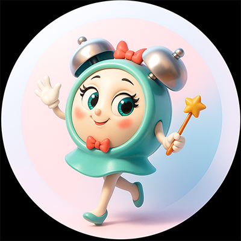
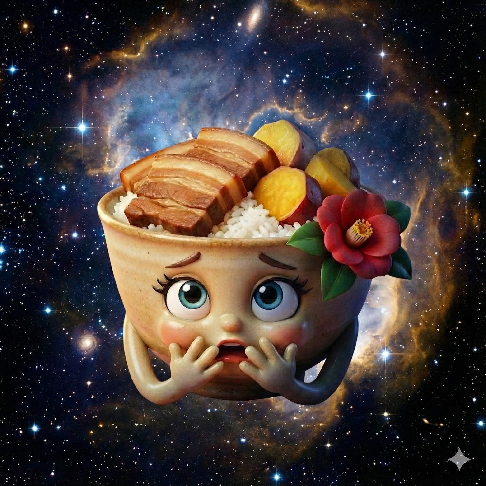

## ポセイ丼星の「とある日」に...

# プロローグ

「運動トラッカー」を完成させたイチカドン。  
その後、`try`、`catch`、`finally`、`throw`...  
エラー処理という名の盾も手に入れ意気揚々。

だが突如、「りんりん」が眼の前に現れたのである。

**りんりん**：  
　「イチカ丼、久しぶり！  
　　最近調子こいてるって本当？  

　　でも、それはまだ『静止した時間』の中での出来事⏰️」

**イチカ丼**：  
　「静止した時間...？ どういうこと？」

**りんりん**：  
　「あなたの知らない『トキの流れ』があるの。  
　　通信、待機、並列処理... それらを操れなければ、一人前にはなれないの⏰️」

**りんりん**：  
　「このポセイ丼星を出て、私の母星でしばらく修行するのはどーぉ？  
　**『時の星』** があなたを呼んでいるわ⏰️」

---

**ナレーター**：  
　「そして今、イチカドンは新たな星へと旅立つ。  
　　そこで彼女を待ち受けるのは、完了を待たずに進む処理の嵐か、  
　　それとも約束（Promise）された未来か...？」

**ナレーター**：  
　「イチカドンの新たな15日間が、今、始まる...！」

## イチカ丼

　「ママ！ わたし、時の星にしばらく行ってくる！  
　　と～～～～ッても久しぶりの星外旅行よ！」

## ママ丼
 
 

体には気をつけるのよ。  
毎日「あるきあるき」するのよ。

-----

# 🕰️ JavaScriptの「時間」を操る！非同期処理・集中講座

**ゴール：** タイマーの基礎から `async/await`、`fetch()`、Web Worker まで、Webで「時間」と「通信」を扱う力を15日で身につける。

## コースの全体像

- **Part 1：キッチンタイマーで学ぶ基礎編** - シングルスレッドとイベントループ、タイマー操作を体験。
- **Part 2：Promise / async/await** - コールバック地獄を整理し、読みやすい非同期コードを書く。
- **Part 3：fetch()で外部APIと通信** - GET/POST、エラーハンドリング、AbortController を使った堅牢な通信。
- **Part 4：Web Worker** - 重い計算を別スレッドに逃がし、UI を滑らかに保つ。

## 進め方

- 日別の詳細シナリオと課題は `D00.md` に集約しています。
- 教材は `D01.md` から `D16.md` を順番に進めてください。
- メタファーや用語の整理も `D00.md` でまとめています。迷ったら戻って確認を。

## 必須の知識

- try... catch... finally... throw などの例外処理は学習済みであること

-----

## 「<ruby>時の星<rt>タイムズ・ドレッド・スター</rt></ruby>」に到着したイチカ丼

ナ、ナナ、なにアレ...

 
 
 
 
　ウゴゴゴゴゴゴゴゴ... 
　ウギギギギギギギギ... 
 
  

 
 
 
 
 

<h1><a href="D00.md">覚悟を決めて「<ruby>時の星<rt>タイムズ・ドレッド・スター</rt></ruby>」へ入港</a></h1>
